```mermaid
erDiagram
    %% === CORE ENTITIES ===
    User {
        ObjectId _id PK
        String email UK
        String password
        String name
        String username
        String avatar
        String role
        String provider
        Boolean emailVerified
        Array refreshToken
        Date expiresAt
        ObjectId aviRol_id FK
        ObjectId aviSubrol_id FK
    }

    AviRol {
        ObjectId _id PK
        String name UK
    }

    AviSubrol {
        ObjectId _id PK
        String name
        ObjectId parentRolId FK
    }

    Conversation {
        ObjectId _id PK
        String conversationId UK
        String title
        String user FK
        Array messages "ObjectId[]"
        String agent_id
        Array tags
        Mixed agentOptions
        Date expiredAt
    }

    Message {
        ObjectId _id PK
        String messageId UK
        String conversationId FK
        String user FK
        String parentMessageId
        String text
        String sender
        Boolean isCreatedByUser
        Number tokenCount
        Object feedback
        Array content
        String conversationSignature
        String clientId
        Number invocationId
        String summary
        String thread_id
        Date expiredAt
    }

    %% === AI ENTITIES ===
    Agent {
        ObjectId _id PK
        String id UK
        String name
        String description
        String instructions
        String provider
        String model
        ObjectId author FK
        String category
        Array projectIds "ObjectId[]"
        Boolean is_promoted
    }

    AgentCategory {
        ObjectId _id PK
        String value UK
        String label
        String description
        Number order
        Boolean isActive
    }

    Assistant {
        ObjectId _id PK
        ObjectId user FK
        String assistant_id
        Array actions
        Number access_level
    }

    Action {
        ObjectId _id PK
        ObjectId user FK
        String action_id
        String type
        Object metadata
        String agent_id
        String assistant_id
    }

    %% === FILE & MEMORY ===
    File {
        ObjectId _id PK
        ObjectId user FK
        String conversationId FK
        String file_id
        String filename
        String filepath
        Number bytes
        String type
        Number usage
        Date expiresAt
    }

    MemoryEntry {
        ObjectId _id PK
        ObjectId userId FK
        String key
        String value
        Number tokenCount
        Date updated_at
    }

    ToolCall {
        ObjectId _id PK
        String conversationId
        String messageId
        String toolId
        ObjectId user FK
        Mixed result
        Mixed attachments
    }

    %% === PROMPTS & PRESETS ===
    Prompt {
        ObjectId _id PK
        ObjectId groupId FK
        ObjectId author FK
        String prompt
        String type
    }

    PromptGroup {
        ObjectId _id PK
        String name
        String category
        Array projectIds "ObjectId[]"
        ObjectId productionId FK
        ObjectId author FK
        String command
    }

    Preset {
        ObjectId _id PK
        String presetId UK
        String title
        String user
        Boolean defaultPreset
        Mixed agentOptions
    }

    Project {
        ObjectId _id PK
        String name
        Array promptGroupIds "ObjectId[]"
        Array agentIds "String[]"
    }

    %% === TRANSACTIONS & BALANCE ===
    Balance {
        ObjectId _id PK
        ObjectId user FK
        Number tokenCredits
        Boolean autoRefillEnabled
        Date lastRefill
    }

    Transaction {
        ObjectId _id PK
        ObjectId user FK
        String conversationId FK
        String tokenType
        String model
        Number tokenValue
        Number inputTokens
    }

    %% === ACCESS CONTROL ===
    Role {
        ObjectId _id PK
        String name UK
        Object permissions
    }

    AccessRole {
        ObjectId _id PK
        String accessRoleId UK
        String name
        String resourceType
        Number permBits
    }

    AclEntry {
        ObjectId _id PK
        String principalType
        Mixed principalId
        String principalModel
        String resourceType
        ObjectId resourceId
        Number permBits
        ObjectId roleId FK
        ObjectId grantedBy FK
    }

    Group {
        ObjectId _id PK
        String name
        String email
        Array memberIds
        String source
        String idOnTheSource
    }

    %% === SHARING & TAGS ===
    ConversationTag {
        ObjectId _id PK
        String tag
        String user
        Number count
        Number position
    }

    SharedLink {
        ObjectId _id PK
        String conversationId
        Array messages "ObjectId[]"
        String shareId
        Boolean isPublic
    }

    %% === AUTH ===
    Session {
        ObjectId _id PK
        String refreshTokenHash
        Date expiration
        ObjectId user FK
    }

    Token {
        ObjectId _id PK
        ObjectId userId FK
        String token
        String type
        Date expiresAt
    }

    Key {
        ObjectId _id PK
        ObjectId userId FK
        String name
        String value
        Date expiresAt
    }

    PluginAuth {
        ObjectId _id PK
        String userId
        String authField
        String value
        String pluginKey
    }

    Banner {
        ObjectId _id PK
        String bannerId
        String message
        Date displayFrom
        Date displayTo
        String type
    }

    %% === RELATIONSHIPS ===

    %% AVI Relationships - NEW
    User ||--o| AviRol : "has avi role"
    User ||--o| AviSubrol : "has avi subrole"
    AviSubrol }o--|| AviRol : "belongs to"

    %% User relationships
    User ||--o{ Session : "has sessions"
    User ||--o{ Token : "has tokens"
    User ||--o| Balance : "has balance"
    User ||--o{ Transaction : "makes transactions"
    User ||--o{ Conversation : "owns"
    User ||--o{ Message : "sends"
    User ||--o{ File : "uploads"
    User ||--o{ Agent : "creates"
    User ||--o{ Assistant : "configures"
    User ||--o{ Action : "defines"
    User ||--o{ Prompt : "authors"
    User ||--o{ PromptGroup : "manages"
    User ||--o{ MemoryEntry : "has memories"
    User ||--o{ Key : "has keys"
    User ||--o{ ToolCall : "executes"
    User ||--o{ ConversationTag : "creates tags"
    User ||--o{ SharedLink : "shares"

    %% Conversation relationships
    Conversation ||--o{ Message : "contains"
    Conversation }o--o{ File : "uses"
    Conversation ||--o{ Transaction : "generates"
    Conversation ||--o{ ToolCall : "has tool calls"
    Conversation ||--o| SharedLink : "can be shared"

    %% Message relationships
    Message }o--|| Conversation : "belongs to"
    Message }o--o| Message : "replies to"
    SharedLink }o--o{ Message : "includes"

    %% Agent relationships
    Agent }o--|| User : "created by"
    Agent }o--|| AgentCategory : "categorized by"
    Agent }o--o{ Project : "belongs to"
    Agent }o--o{ Action : "uses"
    Conversation }o--o| Agent : "uses"

    %% Assistant relationships
    Assistant }o--|| User : "owned by"
    Assistant }o--o{ Action : "uses"

    %% Prompt relationships
    Prompt }o--|| PromptGroup : "belongs to"
    Prompt }o--|| User : "authored by"
    PromptGroup ||--|| Prompt : "production version"
    PromptGroup }o--|| User : "managed by"
    PromptGroup }o--o{ Project : "part of"

    %% Project relationships
    Project }o--o{ PromptGroup : "contains"
    Project }o--o{ Agent : "includes"

    %% ACL relationships - NEW
    User }o--o{ Group : "member of"
    AclEntry }o--o| User : "principal"
    AclEntry }o--o| Group : "principal"
    AclEntry }o--o| Role : "references"
    AclEntry }o--|| AccessRole : "uses role"
    AclEntry }o--|| User : "granted by"
```

# 📊 Diagrama de Arquitectura MongoDB - LibreChat CON AVI ROLES

**Fecha:** 15 de Octubre, 2025  
**Proyecto:** LibreChat-AVI  
**Repositorio:** Edo-Andres/LibreChat-AVI  

---

---

## 📋 Leyenda del Diagrama

### Entidades y Cardinalidad
- **PK**: Primary Key (Clave Primaria)
- **FK**: Foreign Key (Clave Foránea)
- **UK**: Unique Key (Clave Única)
- **||**: Uno a uno
- **}o**: Cero o uno
- **||--o{**: Uno a muchos
- **}o--o{**: Cero a muchos

### Colecciones por Categoría

#### 🔵 **CORE ENTITIES** (Entidades Principales)
- **User**: Usuarios del sistema
- **AviRol**: Roles AVI (NUEVO)
- **AviSubrol**: Sub-roles AVI (NUEVO)
- **Conversation**: Conversaciones
- **Message**: Mensajes

#### 🤖 **AI ENTITIES** (Entidades de IA)
- **Agent**: Agentes de IA
- **AgentCategory**: Categorías de agentes
- **Assistant**: Asistentes
- **Action**: Acciones

#### 📁 **FILE & MEMORY** (Archivos y Memoria)
- **File**: Archivos subidos
- **MemoryEntry**: Entradas de memoria
- **ToolCall**: Llamadas a herramientas

#### 💬 **PROMPTS & PRESETS** (Prompts y Preajustes)
- **Prompt**: Prompts individuales
- **PromptGroup**: Grupos de prompts
- **Preset**: Preajustes
- **Project**: Proyectos

#### 💰 **TRANSACTIONS & BALANCE** (Transacciones y Saldos)
- **Balance**: Saldos de tokens
- **Transaction**: Transacciones

#### 🔐 **ACCESS CONTROL** (Control de Acceso)
- **Role**: Roles tradicionales
- **AccessRole**: Roles de acceso ACL (NUEVO)
- **AclEntry**: Entradas ACL (NUEVO)
- **Group**: Grupos

#### 🔗 **SHARING & TAGS** (Compartición y Etiquetas)
- **ConversationTag**: Etiquetas de conversación
- **SharedLink**: Enlaces compartidos

#### 🔑 **AUTH** (Autenticación)
- **Session**: Sesiones
- **Token**: Tokens
- **Key**: Claves API
- **PluginAuth**: Autenticación de plugins
- **Banner**: Banners

### Relaciones Especiales

#### 🆕 **AVI ROLES System** (NUEVO)
- Usuario puede tener un rol AVI y un sub-rol AVI
- Sub-roles pertenecen a un rol padre

#### 🛡️ **ACL System** (NUEVO)
- Sistema granular de control de acceso
- Principales pueden ser usuarios, grupos o roles
- Permisos bitwise para flexibilidad
- Herencia de permisos

#### 🔄 **Polimorfismo**
- `AclEntry.principalId` puede referenciar User, Group, o Role
- `principalModel` determina la colección destino

#### 🧵 **Threading**
- Mensajes pueden tener parentMessageId para crear hilos
- Estructura de respuestas anidadas