# 📊 Informe de Arquitectura MongoDB - LibreChat CON AVI ROLES

**Fecha:** 15 de Octubre, 2025  
**Proyecto:** LibreChat-AVI  
**Repositorio:** Edo-Andres/LibreChat-AVI  

---

## 📑 Tabla de Contenidos

1. [Resumen Ejecutivo](#resumen-ejecutivo)
2. [Estructura General](#estructura-general)
3. [Modelos y Colecciones](#modelos-y-colecciones)
4. [Relaciones entre Colecciones](#relaciones-entre-colecciones)
5. [Índices y Optimizaciones](#indices-y-optimizaciones)
6. [Características Especiales](#caracteristicas-especiales)

---

## 🎯 Resumen Ejecutivo

LibreChat utiliza **MongoDB** como base de datos principal con **Mongoose** como ODM (Object Document Mapper). La arquitectura está diseñada de forma modular en el paquete `@librechat/data-schemas` y cuenta con **31 colecciones principales** organizadas en categorías funcionales, incluyendo el **sistema AVI ROLES** para gestión avanzada de roles y permisos.

### Ubicación del Código
- **Esquemas:** `packages/data-schemas/src/schema/`
- **Modelos:** `packages/data-schemas/src/models/`
- **Tipos:** `packages/data-schemas/src/types/`
- **Métodos:** `api/models/`

### Cambios Principales vs Versión Sin AVI ROLES:
- ➕ **4 colecciones nuevas:** AviRol, AviSubrol, AccessRole, AclEntry
- 🔧 **Campos extendidos en User:** aviRol_id, aviSubrol_id
- 🔧 **Campos extendidos en Message:** conversationSignature, clientId, invocationId, summary, thread_id
- 🛡️ **Sistema ACL completo:** Control de acceso granular a recursos

---

## 🏗️ Estructura General

### Arquitectura de Paquetes

```
packages/data-schemas/
├── src/
│   ├── schema/          # Definiciones de esquemas Mongoose
│   ├── models/          # Funciones de creación de modelos
│   ├── types/           # Interfaces TypeScript
│   ├── methods/         # Métodos de negocio
│   └── index.ts         # Exportación principal
```

### Función Principal de Creación

```typescript
// packages/data-schemas/src/models/index.ts
export function createModels(mongoose) {
  return {
    User, Token, Session, Balance, Conversation, Message,
    Agent, AgentCategory, Role, Action, Assistant, File,
    Banner, Project, Key, PluginAuth, Transaction, Preset,
    Prompt, PromptGroup, ConversationTag, SharedLink,
    ToolCall, MemoryEntry, AccessRole, AclEntry, Group,
    AviRol, AviSubrol  // ← NUEVO: Sistema AVI ROLES
  };
}
```

---

## 📦 Modelos y Colecciones

### 1. 👤 **User** (Usuarios)

**Colección:** `users`  
**Propósito:** Gestión de usuarios del sistema

**Campos Principales:**
- `email` (String, único, requerido) - Email del usuario
- `password` (String, select: false) - Contraseña hasheada
- `name` (String) - Nombre completo
- `username` (String, lowercase) - Nombre de usuario
- `avatar` (String) - URL del avatar
- `role` (String, default: 'USER') - Rol del sistema
- `provider` (String, default: 'local') - Proveedor de autenticación
- `emailVerified` (Boolean) - Estado de verificación

**OAuth/SSO IDs (todos únicos, sparse):**
- `googleId`, `facebookId`, `openidId`, `samlId`, `ldapId`, `githubId`, `discordId`, `appleId`

**Seguridad 2FA:**
- `twoFactorEnabled` (Boolean)
- `totpSecret` (String, select: false)
- `backupCodes` (Array, select: false)

**Preferencias:**
- `personalization.memories` (Boolean, default: true)
- `termsAccepted` (Boolean)

**Campos Especiales:**
- `refreshToken` (Array de sesiones)
- `expiresAt` (Date, expires: 604800s = 7 días)
- `idOnTheSource` (String, sparse) - ID externo

**🆕 Campos AVI ROLES (NUEVO):**
- `aviRol_id` (ObjectId → AviRol) - Rol AVI asignado
- `aviSubrol_id` (ObjectId → AviSubrol) - Sub-rol AVI asignado

**Índices:**
- `{ email: 1 }` - Único
- `{ aviRol_id: 1 }` - Indexado (NUEVO)
- `{ aviSubrol_id: 1 }` - Indexado (NUEVO)

**Timestamps:** ✅ createdAt, updatedAt

---

### 2. 💬 **Conversation** (Conversaciones)

**Colección:** `conversations`  
**Propósito:** Almacenar conversaciones/chats

**Campos Principales:**
- `conversationId` (String, único, requerido) - UUID de conversación
- `title` (String, default: 'New Chat') - Título
- `user` (String) - ID del usuario propietario
- `messages` (Array[ObjectId]) - Referencia a Message
- `agent_id` (String) - ID del agente utilizado
- `tags` (Array[String]) - Etiquetas de categorización
- `files` (Array[String]) - IDs de archivos adjuntos
- `expiredAt` (Date) - Fecha de expiración

**Configuración de Conversación (conversationPreset):**
- `endpoint`, `model`, `temperature`, `top_p`, `maxTokens`
- `presence_penalty`, `frequency_penalty`
- `system`, `promptPrefix`, `instructions`
- `agentOptions` (Mixed)

**Índices:**
- `{ conversationId: 1 }` - Único
- `{ user: 1 }`
- `{ conversationId: 1, user: 1 }` - Único compuesto
- `{ createdAt: 1, updatedAt: 1 }`
- `{ expiredAt: 1 }` - TTL (expireAfterSeconds: 0)

**Timestamps:** ✅ createdAt, updatedAt

**MeiliSearch:** ✅ conversationId, title, tags

---

### 3. 💭 **Message** (Mensajes)

**Colección:** `messages`  
**Propósito:** Almacenar mensajes individuales de conversaciones

**Campos Principales:**
- `messageId` (String, único, requerido) - UUID del mensaje
- `conversationId` (String, requerido) - Relación con Conversation
- `user` (String, requerido) - Propietario del mensaje
- `parentMessageId` (String) - Mensaje padre (para threading)
- `sender` (String) - Quién envió ('user', 'assistant', etc.)
- `text` (String) - Contenido del mensaje
- `isCreatedByUser` (Boolean, requerido)

**Metadata del Modelo:**
- `model` (String) - Modelo de IA utilizado
- `endpoint` (String) - Endpoint API
- `tokenCount` (Number) - Tokens usados
- `summaryTokenCount` (Number) - Tokens del resumen

**Estado y Errores:**
- `unfinished` (Boolean) - Mensaje incompleto
- `error` (Boolean) - Indica error
- `finish_reason` (String) - Razón de finalización

**Feedback:**
```typescript
feedback: {
  rating: 'thumbsUp' | 'thumbsDown',
  tag: Mixed,
  text: String
}
```

**Contenido Enriquecido:**
- `content` (Array[Mixed]) - Contenido estructurado
- `files` (Array[Mixed]) - Archivos adjuntos
- `attachments` (Array[Mixed]) - Attachments
- `plugins` (Array[Mixed]) - Datos de plugins
- `iconURL` (String) - Icono personalizado

**🆕 Campos Técnicos Extendidos (NUEVO):**
- `conversationSignature` (String) - Firma de conversación
- `clientId` (String) - ID del cliente
- `invocationId` (Number) - ID de invocación
- `summary` (String) - Resumen del mensaje
- `thread_id` (String) - ID del hilo

**Índices:**
- `{ messageId: 1 }` - Único
- `{ conversationId: 1 }`
- `{ user: 1 }`
- `{ messageId: 1, user: 1 }` - Único compuesto
- `{ createdAt: 1 }`
- `{ expiredAt: 1 }` - TTL

**Timestamps:** ✅ createdAt, updatedAt

**MeiliSearch:** ✅ messageId, conversationId, sender, text, content

---

### 4. 🤖 **Agent** (Agentes IA)

**Colección:** `agents`  
**Propósito:** Definición de agentes personalizados

**Campos Principales:**
- `id` (String, único, requerido) - Identificador del agente
- `name` (String) - Nombre del agente
- `description` (String) - Descripción
- `instructions` (String) - Instrucciones del sistema
- `avatar` (Mixed) - Avatar personalizado
- `provider` (String, requerido) - Proveedor (openai, anthropic, etc.)
- `model` (String, requerido) - Modelo a utilizar
- `model_parameters` (Object) - Parámetros del modelo

**Configuración:**
- `artifacts` (String) - Configuración de artefactos
- `access_level` (Number) - Nivel de acceso
- `recursion_limit` (Number) - Límite de recursión
- `hide_sequential_outputs` (Boolean)
- `end_after_tools` (Boolean)

**Herramientas y Acciones:**
- `tools` (Array[String]) - IDs de herramientas
- `tool_kwargs` (Array[Mixed]) - Argumentos de herramientas
- `actions` (Array[String]) - IDs de acciones
- `tool_resources` (Mixed) - Recursos de herramientas

**Autoría y Colaboración:**
- `author` (ObjectId → User, requerido)
- `authorName` (String)
- `isCollaborative` (Boolean)

**Organización:**
- `projectIds` (Array[ObjectId] → Project)
- `category` (String, default: 'general')
- `is_promoted` (Boolean, default: false)
- `versions` (Array[Mixed]) - Historial de versiones

**UI:**
- `conversation_starters` (Array[String]) - Mensajes de inicio
- `support_contact` (Mixed) - Información de contacto

**Índices:**
- `{ id: 1 }` - Único
- `{ author: 1 }`
- `{ projectIds: 1 }`
- `{ category: 1 }`
- `{ is_promoted: 1 }`
- `{ updatedAt: -1, _id: 1 }`

**Timestamps:** ✅ createdAt, updatedAt

---

### 5. 🏷️ **AgentCategory** (Categorías de Agentes)

**Colección:** `agentcategories`  
**Propósito:** Categorización de agentes

**Campos:**
- `value` (String, único, requerido, lowercase, trim) - Valor interno
- `label` (String, requerido, trim) - Etiqueta visible
- `description` (String, trim) - Descripción
- `order` (Number, default: 0) - Orden de visualización
- `isActive` (Boolean, default: true) - Estado activo
- `custom` (Boolean, default: false) - Categoría personalizada

**Índices:**
- `{ value: 1 }` - Único
- `{ order: 1 }`
- `{ isActive: 1 }`
- `{ isActive: 1, order: 1 }` - Compuesto
- `{ order: 1, label: 1 }` - Compuesto

**Timestamps:** ✅ createdAt, updatedAt

---

### 6. 🎭 **Assistant** (Asistentes OpenAI)

**Colección:** `assistants`  
**Propósito:** Configuración de asistentes de OpenAI API

**Campos:**
- `user` (ObjectId → User, requerido)
- `assistant_id` (String, requerido) - ID de OpenAI
- `avatar` (Mixed) - Avatar personalizado
- `conversation_starters` (Array[String])
- `access_level` (Number) - Nivel de acceso
- `file_ids` (Array[String]) - IDs de archivos
- `actions` (Array[String]) - IDs de acciones
- `append_current_datetime` (Boolean, default: false)

**Índices:**
- `{ assistant_id: 1 }`
- `{ user: 1 }`

**Timestamps:** ✅ createdAt, updatedAt

---

### 7. 📁 **File** (Archivos)

**Colección:** `files`  
**Propósito:** Gestión de archivos subidos

**Campos Principales:**
- `user` (ObjectId → User, requerido)
- `conversationId` (String → Conversation)
- `file_id` (String, requerido) - Identificador único
- `temp_file_id` (String) - ID temporal
- `filename` (String, requerido) - Nombre del archivo
- `filepath` (String, requerido) - Ruta en el sistema
- `bytes` (Number, requerido) - Tamaño en bytes
- `type` (String, requerido) - Tipo MIME
- `object` (String, default: 'file')

**Metadata:**
- `embedded` (Boolean) - Si está embedido
- `text` (String) - Texto extraído
- `context` (String) - Contexto adicional
- `usage` (Number, default: 0) - Contador de uso
- `source` (String, default: 'local') - Origen del archivo
- `model` (String) - Modelo usado para procesar

**Imágenes:**
- `width` (Number)
- `height` (Number)

**Especiales:**
- `metadata.fileIdentifier` (String)
- `expiresAt` (Date, expires: 3600s = 1 hora) - TTL

**Índices:**
- `{ user: 1 }`
- `{ conversationId: 1 }`
- `{ file_id: 1 }`
- `{ createdAt: 1, updatedAt: 1 }`

**Timestamps:** ✅ createdAt, updatedAt

---

### 8. 💰 **Balance** (Saldos de Usuario)

**Colección:** `balances`  
**Propósito:** Gestión de créditos/tokens de usuarios

**Campos:**
- `user` (ObjectId → User, requerido)
- `tokenCredits` (Number, default: 0) - 1000 = $0.001 USD

**Auto-Recarga:**
- `autoRefillEnabled` (Boolean, default: false)
- `refillIntervalValue` (Number, default: 30)
- `refillIntervalUnit` (String, enum: ['seconds', 'minutes', 'hours', 'days', 'weeks', 'months'])
- `lastRefill` (Date, default: Date.now)
- `refillAmount` (Number, default: 0)

**Índices:**
- `{ user: 1 }`

**Timestamps:** ❌

---

### 9. 🧾 **Transaction** (Transacciones)

**Colección:** `transactions`  
**Propósito:** Registro de uso de tokens/créditos

**Campos:**
- `user` (ObjectId → User, requerido)
- `conversationId` (String → Conversation)
- `tokenType` (String, enum: ['prompt', 'completion', 'credits'], requerido)
- `model` (String) - Modelo utilizado
- `context` (String) - Contexto de uso
- `valueKey` (String) - Clave de valor
- `rate` (Number) - Tasa aplicada
- `rawAmount` (Number) - Cantidad cruda
- `tokenValue` (Number) - Valor en tokens
- `inputTokens` (Number) - Tokens de entrada
- `writeTokens` (Number) - Tokens de escritura
- `readTokens` (Number) - Tokens de lectura

**Índices:**
- `{ user: 1 }`
- `{ conversationId: 1 }`

**Timestamps:** ✅ createdAt, updatedAt

---

### 10. 🎨 **Preset** (Presets de Conversación)

**Colección:** `presets`  
**Propósito:** Configuraciones predefinidas para conversaciones

**Campos:**
- `presetId` (String, único, requerido)
- `title` (String, default: 'New Chat')
- `user` (String, default: null)
- `defaultPreset` (Boolean) - Si es preset por defecto
- `order` (Number) - Orden de visualización

**Hereda de conversationPreset:**
- Todos los campos de configuración de modelo (endpoint, model, temperature, etc.)
- `agentOptions` (Mixed)

**Índices:**
- `{ presetId: 1 }` - Único

**Timestamps:** ✅ createdAt, updatedAt

**MeiliSearch:** ✅ title

---

### 11. 📝 **Prompt** (Prompts)

**Colección:** `prompts`  
**Propósito:** Almacenar prompts individuales

**Campos:**
- `groupId` (ObjectId → PromptGroup, requerido)
- `author` (ObjectId → User, requerido)
- `prompt` (String, requerido) - Contenido del prompt
- `type` (String, enum: ['text', 'chat'], requerido)

**Índices:**
- `{ groupId: 1 }`
- `{ author: 1 }`
- `{ createdAt: 1, updatedAt: 1 }`

**Timestamps:** ✅ createdAt, updatedAt

---

### 12. 📚 **PromptGroup** (Grupos de Prompts)

**Colección:** `promptgroups`  
**Propósito:** Agrupar y gestionar colecciones de prompts

**Campos:**
- `name` (String, requerido) - Nombre del grupo
- `numberOfGenerations` (Number, default: 0) - Contador de uso
- `oneliner` (String, default: '') - Descripción corta
- `category` (String, default: '') - Categoría
- `projectIds` (Array[ObjectId] → Project)
- `productionId` (ObjectId → Prompt, requerido) - Prompt en producción
- `author` (ObjectId → User, requerido)
- `authorName` (String, requerido)
- `command` (String, max: 50) - Comando de acceso rápido (solo lowercase, alfanumérico y guiones)

**Índices:**
- `{ name: 1 }`
- `{ category: 1 }`
- `{ projectIds: 1 }`
- `{ productionId: 1 }`
- `{ author: 1 }`
- `{ command: 1 }`
- `{ createdAt: 1, updatedAt: 1 }`

**Timestamps:** ✅ createdAt, updatedAt

---

### 13. 🏢 **Project** (Proyectos)

**Colección:** `projects`  
**Propósito:** Organizar agentes y prompts en proyectos

**Campos:**
- `name` (String, requerido) - Nombre del proyecto
- `promptGroupIds` (Array[ObjectId] → PromptGroup)
- `agentIds` (Array[String] → Agent)

**Índices:**
- `{ name: 1 }`

**Timestamps:** ✅ createdAt, updatedAt

---

### 14. 🔐 **Role** (Roles y Permisos)

**Colección:** `roles`  
**Propósito:** Gestión de roles y permisos del sistema

**Campos:**
- `name` (String, único, requerido) - Nombre del rol
- `permissions` (Object) - Objeto de permisos

**Estructura de Permisos:**
```typescript
{
  bookmarks: { use: Boolean },
  prompts: { shared_global: Boolean, use: Boolean, create: Boolean },
  memories: { use: Boolean, create: Boolean, update: Boolean, read: Boolean, opt_out: Boolean },
  agents: { shared_global: Boolean, use: Boolean, create: Boolean },
  multi_convo: { use: Boolean },
  temporary_chat: { use: Boolean },
  run_code: { use: Boolean },
  web_search: { use: Boolean },
  people_picker: { view_users: Boolean, view_groups: Boolean, view_roles: Boolean },
  marketplace: { use: Boolean },
  file_search: { use: Boolean },
  file_citations: { use: Boolean }
}
```

**Índices:**
- `{ name: 1 }` - Único

**Timestamps:** ❌

---

### 15. ⚡ **Action** (Acciones/Custom Actions)

**Colección:** `actions`  
**Propósito:** Definir acciones personalizadas para agentes

**Campos:**
- `user` (ObjectId → User, requerido)
- `action_id` (String, requerido)
- `type` (String, default: 'action_prototype')
- `settings` (Mixed) - Configuración de la acción
- `agent_id` (String) - Agente asociado
- `assistant_id` (String) - Asistente asociado

**Metadata:**
- `metadata.api_key` (String)
- `metadata.domain` (String, requerido)
- `metadata.privacy_policy_url` (String)
- `metadata.raw_spec` (String) - Especificación OpenAPI
- `metadata.oauth_client_id` (String)
- `metadata.oauth_client_secret` (String)

**Auth (sub-schema):**
```typescript
auth: {
  authorization_type: String,
  custom_auth_header: String,
  type: 'service_http' | 'oauth' | 'none',
  authorization_content_type: String,
  authorization_url: String,
  client_url: String,
  scope: String,
  token_exchange_method: 'default_post' | 'basic_auth_header' | null
}
```

**Índices:**
- `{ user: 1 }`
- `{ action_id: 1 }`

**Timestamps:** ❌

---

### 16. 🏷️ **ConversationTag** (Etiquetas de Conversación)

**Colección:** `conversationtags`  
**Propósito:** Gestionar etiquetas/tags para organizar conversaciones

**Campos:**
- `tag` (String) - Nombre de la etiqueta
- `user` (String) - Usuario propietario
- `description` (String) - Descripción
- `count` (Number, default: 0) - Contador de uso
- `position` (Number, default: 0) - Posición de ordenamiento

**Índices:**
- `{ tag: 1 }`
- `{ user: 1 }`
- `{ description: 1 }`
- `{ position: 1 }`
- `{ tag: 1, user: 1 }` - Único compuesto

**Timestamps:** ✅ createdAt, updatedAt

---

### 17. 🔗 **SharedLink** (Enlaces Compartidos)

**Colección:** `sharedlinks`  
**Propósito:** Compartir conversaciones públicamente

**Campos:**
- `conversationId` (String, requerido)
- `title` (String) - Título de la conversación
- `user` (String) - Usuario propietario
- `messages` (Array[ObjectId] → Message) - Mensajes incluidos
- `shareId` (String) - ID único del enlace
- `isPublic` (Boolean, default: true)

**Índices:**
- `{ title: 1 }`
- `{ user: 1 }`
- `{ shareId: 1 }`

**Timestamps:** ✅ createdAt, updatedAt

---

### 18. 🧠 **MemoryEntry** (Memorias de Usuario)

**Colección:** `memoryentries`  
**Propósito:** Almacenar memorias personalizadas de usuarios (feature de personalización)

**Campos:**
- `userId` (ObjectId → User, requerido)
- `key` (String, requerido) - Clave (solo lowercase y underscores)
- `value` (String, requerido) - Valor de la memoria
- `tokenCount` (Number, default: 0) - Tokens usados
- `updated_at` (Date, default: Date.now)

**Validaciones:**
- `key`: Regex `/^[a-z_]+$/`

**Índices:**
- `{ userId: 1 }`

**Timestamps:** ❌

---

### 19. 🛠️ **ToolCall** (Llamadas a Herramientas)

**Colección:** `toolcalls`  
**Propósito:** Registrar llamadas a herramientas/tools de agentes

**Campos:**
- `conversationId` (String, requerido)
- `messageId` (String, requerido)
- `toolId` (String, requerido) - ID de la herramienta
- `user` (ObjectId → User, requerido)
- `result` (Mixed) - Resultado de la herramienta
- `attachments` (Mixed) - Archivos adjuntos
- `blockIndex` (Number) - Índice de bloque
- `partIndex` (Number) - Índice de parte

**Índices:**
- `{ messageId: 1, user: 1 }` - Compuesto
- `{ conversationId: 1, user: 1 }` - Compuesto

**Timestamps:** ✅ createdAt, updatedAt

---

### 20. 🔑 **Key** (Claves API de Usuario)

**Colección:** `keys`  
**Propósito:** Almacenar claves API personalizadas de usuarios

**Campos:**
- `userId` (ObjectId → User, requerido)
- `name` (String, requerido) - Nombre de la clave
- `value` (String, requerido) - Valor de la clave
- `expiresAt` (Date) - Fecha de expiración

**Índices:**
- `{ expiresAt: 1 }` - TTL (expireAfterSeconds: 0)

**Timestamps:** ❌

---

### 21. 🔌 **PluginAuth** (Autenticación de Plugins)

**Colección:** `pluginauths`  
**Propósito:** Credenciales para plugins de terceros

**Campos:**
- `authField` (String, requerido) - Campo de autenticación
- `value` (String, requerido) - Valor de autenticación
- `userId` (String, requerido)
- `pluginKey` (String) - Clave del plugin

**Índices:** (ninguno explícito)

**Timestamps:** ✅ createdAt, updatedAt

---

### 22. 🎫 **Token** (Tokens de Verificación)

**Colección:** `tokens`  
**Propósito:** Tokens para verificación de email, reset de password, etc.

**Campos:**
- `userId` (ObjectId → User, requerido)
- `email` (String)
- `type` (String) - Tipo de token
- `identifier` (String) - Identificador adicional
- `token` (String, requerido) - Token hasheado
- `createdAt` (Date, default: Date.now)
- `expiresAt` (Date, requerido)
- `metadata` (Map[String, Mixed]) - Metadata adicional

**Índices:**
- `{ expiresAt: 1 }` - TTL (expireAfterSeconds: 0)

**Timestamps:** ❌ (campo createdAt manual)

---

### 23. 📅 **Session** (Sesiones)

**Colección:** `sessions`  
**Propósito:** Gestionar sesiones de usuario (refresh tokens)

**Campos:**
- `refreshTokenHash` (String, requerido) - Hash del refresh token
- `expiration` (Date, requerido) - Fecha de expiración
- `user` (ObjectId → User, requerido)

**Índices:**
- `{ expiration: 1 }` - TTL (expires: 0)

**Timestamps:** ❌

---

### 24. 📢 **Banner** (Banners del Sistema)

**Colección:** `banners`  
**Propósito:** Mostrar anuncios/banners en la UI

**Campos:**
- `bannerId` (String, requerido)
- `message` (String, requerido) - Contenido del banner
- `displayFrom` (Date, default: Date.now)
- `displayTo` (Date) - Fecha de fin
- `type` (String, enum: ['banner', 'popup'], default: 'banner')
- `isPublic` (Boolean, default: false)

**Índices:** (ninguno explícito)

**Timestamps:** ✅ createdAt, updatedAt

---

### 25. 🔐 **AccessRole** (Roles de Acceso a Recursos) - 🆕 NUEVO

**Colección:** `accessroles`  
**Propósito:** Definir roles de acceso para recursos específicos

**Campos:**
- `accessRoleId` (String, único, requerido)
- `name` (String, requerido) - Nombre del rol
- `description` (String) - Descripción
- `resourceType` (String, enum: ['agent', 'project', 'file', 'promptGroup'], default: 'agent')
- `permBits` (Number, requerido) - Bits de permisos

**Índices:**
- `{ accessRoleId: 1 }` - Único

**Timestamps:** ✅ createdAt, updatedAt

---

### 26. 🔒 **AclEntry** (Entradas ACL - Access Control List) - 🆕 NUEVO

**Colección:** `aclentries`  
**Propósito:** Control de acceso granular a recursos

**Campos Principales:**
- `principalType` (String, enum: PrincipalType, requerido) - 'user', 'group', 'role', 'public'
- `principalId` (Mixed, refPath) - ID del principal
- `principalModel` (String, enum: PrincipalModel) - 'User', 'Group', 'Role'
- `resourceType` (String, enum: ResourceType, requerido) - Tipo de recurso
- `resourceId` (ObjectId, requerido) - ID del recurso
- `permBits` (Number, default: 1) - Permisos en bits
- `roleId` (ObjectId → AccessRole) - Rol de acceso
- `inheritedFrom` (ObjectId, sparse) - ACL heredado
- `grantedBy` (ObjectId → User) - Quién otorgó el permiso
- `grantedAt` (Date, default: Date.now) - Cuándo se otorgó

**Índices Compuestos:**
- `{ principalId: 1, principalType: 1, resourceType: 1, resourceId: 1 }`
- `{ resourceId: 1, principalType: 1, principalId: 1 }`
- `{ principalId: 1, permBits: 1, resourceType: 1 }`
- `{ inheritedFrom: 1 }` - Sparse

**Timestamps:** ✅ createdAt, updatedAt

---

### 27. 👥 **Group** (Grupos de Usuarios)

**Colección:** `groups`  
**Propósito:** Agrupar usuarios para gestión de permisos

**Campos:**
- `name` (String, requerido) - Nombre del grupo
- `description` (String) - Descripción
- `email` (String) - Email del grupo
- `avatar` (String) - Avatar del grupo
- `memberIds` (Array[String]) - IDs de miembros
- `source` (String, enum: ['local', 'entra'], default: 'local') - Origen del grupo
- `idOnTheSource` (String, sparse) - ID externo (requerido si source !== 'local')

**Índices:**
- `{ name: 1 }`
- `{ email: 1 }`
- `{ idOnTheSource: 1 }`
- `{ idOnTheSource: 1, source: 1 }` - Único (con filtro parcial)
- `{ memberIds: 1 }`

**Timestamps:** ✅ createdAt, updatedAt

---

### 28. 🎭 **AviRol** (Roles AVI) - 🆕 NUEVO

**Colección:** `aviroles`  
**Propósito:** Gestión de roles del sistema AVI

**Campos:**
- `name` (String, único, requerido, indexado, trim) - Nombre del rol AVI

**Índices:**
- `{ name: 1 }` - Único

**Timestamps:** ✅ createdAt, updatedAt

---

### 29. 🎭 **AviSubrol** (Sub-roles AVI) - 🆕 NUEVO

**Colección:** `avisubroles`  
**Propósito:** Sub-roles que dependen de un rol padre AVI

**Campos:**
- `name` (String, requerido, trim) - Nombre del sub-rol
- `parentRolId` (ObjectId → AviRol, requerido, indexado) - Rol padre

**Índices:**
- `{ name: 1, parentRolId: 1 }` - Único compuesto
- `{ parentRolId: 1 }`

**Timestamps:** ✅ createdAt, updatedAt

---

## 🔗 Relaciones entre Colecciones

### Diagrama de Relaciones Principales

```mermaid
graph TB
    %% Usuarios y Autenticación
    User[👤 User]
    Session[📅 Session]
    Token[🎫 Token]
    Balance[💰 Balance]
    Transaction[🧾 Transaction]
    
    %% Sistema AVI ROLES - NUEVO
    AviRol[🎭 AviRol]
    AviSubrol[🎭 AviSubrol]
    
    %% Conversaciones y Mensajes
    Conversation[💬 Conversation]
    Message[💭 Message]
    File[📁 File]
    ConversationTag[🏷️ ConversationTag]
    SharedLink[🔗 SharedLink]
    ToolCall[🛠️ ToolCall]
    
    %% Agentes y Asistentes
    Agent[🤖 Agent]
    AgentCategory[🏷️ AgentCategory]
    Assistant[🎭 Assistant]
    Action[⚡ Action]
    
    %% Prompts y Presets
    Prompt[📝 Prompt]
    PromptGroup[📚 PromptGroup]
    Preset[🎨 Preset]
    Project[🏢 Project]
    
    %% Control de Acceso
    Role[🔐 Role]
    AccessRole[🔐 AccessRole]
    AclEntry[🔒 AclEntry]
    Group[👥 Group]
    
    %% Otros
    MemoryEntry[🧠 MemoryEntry]
    Key[🔑 Key]
    PluginAuth[🔌 PluginAuth]
    
    %% Relaciones AVI - NUEVO
    User -->|1:1| AviRol
    User -->|1:1| AviSubrol
    AviSubrol -->|N:1| AviRol
    
    %% Relaciones User
    User -->|1:N| Session
    User -->|1:N| Token
    User -->|1:1| Balance
    User -->|1:N| Transaction
    User -->|1:N| Conversation
    User -->|1:N| Message
    User -->|1:N| File
    User -->|1:N| Agent
    User -->|1:N| Assistant
    User -->|1:N| Action
    User -->|1:N| Prompt
    User -->|1:N| PromptGroup
    User -->|1:N| MemoryEntry
    User -->|1:N| Key
    User -->|1:N| ToolCall
    User -->|1:N| ConversationTag
    User -->|1:N| SharedLink
    
    %% Relaciones Conversation
    Conversation -->|1:N| Message
    Conversation -->|N:M| File
    Conversation -->|1:N| Transaction
    Conversation -->|1:N| ToolCall
    Conversation -->|1:1| SharedLink
    
    %% Relaciones Message
    Message -->|N:1| Conversation
    Message -->|self-ref| Message
    SharedLink -->|N:M| Message
    
    %% Relaciones Agent
    Agent -->|N:1| User
    Agent -->|N:1| AgentCategory
    Agent -->|N:M| Project
    Agent -->|N:M| Action
    Conversation -->|N:1| Agent
    
    %% Relaciones Assistant
    Assistant -->|N:1| User
    Assistant -->|N:M| Action
    
    %% Relaciones Prompt
    Prompt -->|N:1| PromptGroup
    Prompt -->|N:1| User
    PromptGroup -->|1:1| Prompt
    PromptGroup -->|N:1| User
    PromptGroup -->|N:M| Project
    
    %% Relaciones Project
    Project -->|N:M| PromptGroup
    Project -->|N:M| Agent
    
    %% Relaciones ACL - NUEVO
    User -->|N:M| Group
    AclEntry -->|N:1| User
    AclEntry -->|N:1| Group
    AclEntry -->|N:1| Role
    AclEntry -->|N:1| AccessRole
    AclEntry -->|polymorphic| Agent
    AclEntry -->|polymorphic| Project
    AclEntry -->|polymorphic| File
    AclEntry -->|polymorphic| PromptGroup
```



---

##  Índices y Optimizaciones

### Índices Únicos

| Colección | Índice | Tipo |
|-----------|--------|------|
| User | `{ email: 1 }` | Único |
| Conversation | `{ conversationId: 1 }` | Único |
| Conversation | `{ conversationId: 1, user: 1 }` | Único Compuesto |
| Message | `{ messageId: 1 }` | Único |
| Message | `{ messageId: 1, user: 1 }` | Único Compuesto |
| Agent | `{ id: 1 }` | Único |
| AgentCategory | `{ value: 1 }` | Único |
| Preset | `{ presetId: 1 }` | Único |
| Role | `{ name: 1 }` | Único |
| ConversationTag | `{ tag: 1, user: 1 }` | Único Compuesto |
| AccessRole | `{ accessRoleId: 1 }` | Único (NUEVO) |
| AviRol | `{ name: 1 }` | Único (NUEVO) |
| AviSubrol | `{ name: 1, parentRolId: 1 }` | Único Compuesto (NUEVO) |
| Group | `{ idOnTheSource: 1, source: 1 }` | Único Condicional |

### Índices TTL (Time To Live)

| Colección | Campo | Tiempo de Expiración |
|-----------|-------|---------------------|
| User | `expiresAt` | 604800s (7 días) |
| Conversation | `expiredAt` | 0s (inmediato) |
| Message | `expiredAt` | 0s (inmediato) |
| File | `expiresAt` | 3600s (1 hora) |
| Token | `expiresAt` | 0s (inmediato) |
| Session | `expiration` | 0s (inmediato) |
| Key | `expiresAt` | 0s (inmediato) |

### Índices Compuestos para Performance

| Colección | Índice Compuesto | Propósito |
|-----------|------------------|-----------|
| Agent | `{ updatedAt: -1, _id: 1 }` | Paginación ordenada |
| AgentCategory | `{ isActive: 1, order: 1 }` | Filtrado y ordenamiento |
| AgentCategory | `{ order: 1, label: 1 }` | Ordenamiento UI |
| AclEntry | `{ principalId: 1, principalType: 1, resourceType: 1, resourceId: 1 }` | Verificación de permisos (NUEVO) |
| AclEntry | `{ resourceId: 1, principalType: 1, principalId: 1 }` | Búsqueda inversa (NUEVO) |
| AclEntry | `{ principalId: 1, permBits: 1, resourceType: 1 }` | Filtrado de permisos (NUEVO) |
| ToolCall | `{ messageId: 1, user: 1 }` | Búsqueda por mensaje |
| ToolCall | `{ conversationId: 1, user: 1 }` | Búsqueda por conversación |

### Índices Adicionales (NUEVO)

| Colección | Índice | Propósito |
|-----------|--------|-----------|
| User | `{ aviRol_id: 1 }` | Búsqueda por rol AVI |
| User | `{ aviSubrol_id: 1 }` | Búsqueda por sub-rol AVI |
| AviSubrol | `{ parentRolId: 1 }` | Búsqueda de sub-roles por rol padre |
| AclEntry | `{ inheritedFrom: 1 }` | Herencia de permisos (sparse) |

### Índices Sparse

Índices que solo indexan documentos donde el campo existe:

- `User.googleId`, `User.facebookId`, `User.openidId`, etc. (todos los OAuth IDs)
- `User.idOnTheSource`
- `Group.idOnTheSource`
- `AclEntry.inheritedFrom` (NUEVO)

---

## ⭐ Características Especiales

### 1. 🔍 MeiliSearch Integration

Campos marcados con `meiliIndex: true` son indexados en MeiliSearch para búsqueda full-text:

**Conversation:**
- `conversationId`, `title`, `tags`

**Message:**
- `messageId`, `conversationId`, `sender`, `text`, `content`

**Preset:**
- `title`

### 2. 🔐 Campos Select: false

Campos excluidos por defecto en queries (seguridad):

**User:**
- `password`
- `totpSecret`
- `backupCodes`

**Message:**
- `_meiliIndex`

### 3. 🔄 Soft Delete / Expiration

**Conversaciones Temporales:**
- Campo `expiredAt` permite conversaciones que se auto-eliminan
- Útil para "temporary chat" feature

**Archivos Temporales:**
- Files con TTL de 1 hora por defecto
- Limpieza automática de archivos no utilizados

### 4. 🎭 Polimorfismo con refPath

**AclEntry.principalId:**
- Puede referenciar `User`, `Group`, o `Role`
- Usa `principalModel` para determinar la colección destino

### 5. 📊 Sistema de Créditos/Tokens

**Conversión:**
- 1000 tokenCredits = 1 mill = $0.001 USD

**Auto-Recarga:**
- Configuración flexible por intervalo de tiempo
- Recarga automática basada en `lastRefill`

### 6. 🔢 Permisos Bitwise (permBits)

Los permisos se almacenan como números usando operaciones bitwise:

```typescript
// Ejemplo de permBits
READ = 1    // 0001
WRITE = 2   // 0010
DELETE = 4  // 0100
ADMIN = 8   // 1000

// Combinación: READ + WRITE = 3 (0011)
```

### 7. 🔗 Self-Referencing

**Message.parentMessageId:**
- Permite crear árboles de conversación
- Threading de mensajes
- Estructura de respuestas anidadas

### 8. 📦 Versioning de Agentes

**Agent.versions:**
- Array de versiones históricas
- Rollback capability
- Historial de cambios

### 9. 🎨 Comandos Rápidos de Prompts

**PromptGroup.command:**
- Acceso rápido tipo slash-command
- Validación estricta: solo lowercase, alfanumérico y guiones
- Máximo 50 caracteres

### 10. 🌐 Multi-Source Support

**User y Group:**
- `source`: 'local' o 'entra' (Azure AD)
- `idOnTheSource`: ID en el sistema externo
- Soporte para sincronización con directorios externos

### 11. 🆕 Sistema AVI ROLES (NUEVO)

**Jerarquía de Roles:**
- **AviRol:** Roles principales del sistema AVI
- **AviSubrol:** Sub-roles dependientes de un rol padre
- **Relación:** Un usuario tiene 1 rol AVI y 1 sub-rol AVI opcional

**Control de Acceso Avanzado:**
- **AccessRole:** Define permisos específicos para tipos de recursos
- **AclEntry:** Implementa control de acceso granular con herencia
- **Polimorfismo:** Soporte para diferentes tipos de entidades (User, Group, Role)

---

## 🛠️ Métodos Principales del API

### User Methods
```typescript
// api/models/userMethods.js
- comparePassword(candidatePassword, userPassword)

// Desde createMethods()
- findUser(query, options?)
- createUser(userData)
- updateUser(userId, updateData)
- deleteUser(userId)
```

### File Methods
```typescript
// api/models/File.js
- findFileById(fileId)
- createFile(fileData)
- updateFile(fileId, updateData)
- deleteFile(fileId)
- deleteFiles(query)
- getFiles(query)
- updateFileUsage(fileId, usage)
```

### Message Methods
```typescript
// api/models/Message.js
- getMessage(messageId)
- getMessages(query)
- saveMessage(messageData)
- recordMessage(messageData)  // Con validación
- updateMessage(messageId, updateData)
- deleteMessagesSince(messageId, conversationId)
- deleteMessages(query)
```

### Conversation Methods
```typescript
// api/models/Conversation.js
- getConvoTitle(conversationId)
- getConvo(conversationId)
- saveConvo(conversationData)
- deleteConvos(query)
```

### Preset Methods
```typescript
// api/models/Preset.js
- getPreset(presetId)
- getPresets(query)
- savePreset(presetData)
- deletePresets(query)
```

### Balance Methods
```typescript
// api/models/balanceMethods.js
- createBalance(userId, initialBalance?)
- getBalance(userId)
- updateBalance(userId, amount)
- checkBalance(userId, requiredAmount)
- refillBalance(userId)
```

### Transaction Methods
```typescript
// api/models/tx.js
- recordTransaction(transactionData)
- getUserTransactions(userId, filters?)
- getConversationTransactions(conversationId)
```

### AVI ROLES Methods (NUEVO)
```typescript
// Métodos para gestión de roles AVI
- createAviRol(rolData)
- getAviRol(rolId)
- createAviSubrol(subrolData)
- getAviSubrolesByParent(parentRolId)
- assignAviRolToUser(userId, rolId, subrolId?)
```

### ACL Methods (NUEVO)
```typescript
// Métodos para control de acceso
- createAccessRole(roleData)
- grantPermission(aclEntryData)
- checkPermission(principalId, resourceId, permission)
- revokePermission(aclEntryId)
- getInheritedPermissions(resourceId)
```

### Initialization Methods
```typescript
// Desde createMethods()
- initializeRoles()
- seedDefaultRoles()
- ensureDefaultCategories()
- seedDatabase()  // Ejecuta todos los init
- initializeAviRoles()  // NUEVO: Inicializa roles AVI
- seedDefaultAccessRoles()  // NUEVO: Roles de acceso por defecto
```

---

## 📋 Resumen de Colecciones por Categoría

### 🔐 Autenticación y Usuarios (5)
1. **User** - Usuarios del sistema
2. **Session** - Sesiones de usuario
3. **Token** - Tokens de verificación
4. **Key** - Claves API personalizadas
5. **PluginAuth** - Auth de plugins

### 💬 Conversaciones y Mensajes (5)
6. **Conversation** - Conversaciones
7. **Message** - Mensajes individuales
8. **ConversationTag** - Etiquetas de conversaciones
9. **SharedLink** - Enlaces compartidos
10. **ToolCall** - Llamadas a herramientas

### 🤖 IA y Agentes (5)
11. **Agent** - Agentes personalizados
12. **AgentCategory** - Categorías de agentes
13. **Assistant** - Asistentes OpenAI
14. **Action** - Acciones customizadas
15. **MemoryEntry** - Memorias de usuario

### 📝 Prompts y Configuración (4)
16. **Prompt** - Prompts individuales
17. **PromptGroup** - Grupos de prompts
18. **Preset** - Presets de conversación
19. **Project** - Proyectos organizacionales

### 💰 Transacciones y Balance (2)
20. **Balance** - Saldos de usuario
21. **Transaction** - Transacciones de tokens

### 🔒 Control de Acceso (6) - **EXPANDIDO**
22. **Role** - Roles del sistema
23. **AccessRole** - Roles de acceso a recursos (NUEVO)
24. **AclEntry** - Entradas ACL (NUEVO)
25. **Group** - Grupos de usuarios
26. **AviRol** - Roles AVI (NUEVO)
27. **AviSubrol** - Sub-roles AVI (NUEVO)

### 📁 Archivos y Otros (2)
28. **File** - Archivos subidos
29. **Banner** - Banners del sistema

---

## 🎯 Conclusiones

### Fortalezas de la Arquitectura CON AVI ROLES

1. **✅ Arquitectura Base Intacta:** Mantiene todas las fortalezas del sistema original
2. **➕ Sistema AVI ROLES:** Jerarquía de roles y sub-roles para gestión avanzada de usuarios
3. **🛡️ Control de Acceso Granular:** Sistema ACL completo con herencia de permisos
4. **🔧 Extensiones Técnicas:** Campos adicionales en Message para mejor tracking
5. **📈 Escalabilidad Mejorada:** 31 colecciones organizadas y optimizadas
6. **🔗 Relaciones Polimórficas:** Soporte flexible para diferentes tipos de entidades
7. **⚡ Performance Optimizada:** Índices estratégicos para consultas eficientes

### Mejoras Implementadas

**Sistema AVI ROLES:**
- ✅ Jerarquía rol → sub-rol
- ✅ Integración nativa con usuarios
- ✅ Índices optimizados para búsquedas

**Control de Acceso Avanzado:**
- ✅ ACL con herencia de permisos
- ✅ Permisos bitwise eficientes
- ✅ Polimorfismo para diferentes tipos de recursos

**Extensiones Técnicas:**
- ✅ Campos de tracking en mensajes
- ✅ Firma de conversaciones
- ✅ Soporte para threading avanzado

### Puntos de Atención

1. **⚠️ Complejidad ACL:** Sistema de permisos muy granular requiere comprensión detallada
2. **⚠️ Relaciones Polimórficas:** AclEntry usa refPath, requiere validación cuidadosa
3. **⚠️ Consistencia de Datos:** Múltiples referencias requieren transacciones o cleanup jobs
4. **⚠️ TTL Management:** Documentos pueden expirar, necesita backup/arhivo antes de expiración

### Recomendaciones

1. **📌 Implementar Transacciones:** Para operaciones que afectan múltiples colecciones
2. **📌 Jobs de Limpieza:** Para relaciones huérfanas (mensajes sin conversación, etc.)
3. **📌 Monitoreo de TTL:** Alertas antes de expiración de datos importantes
4. **📌 Backup Strategy:** Plan de respaldo especialmente para conversaciones con expiredAt
5. **📌 Documentación ACL:** Guías detalladas para configuración de permisos
6. **📌 Testing AVI ROLES:** Casos de prueba exhaustivos para jerarquía de roles
7. **📌 Índices Adicionales:** Según patrones de uso real en producción

---

## 📚 Referencias

- **Mongoose Documentation:** https://mongoosejs.com/
- **MongoDB Indexes:** https://docs.mongodb.com/manual/indexes/
- **MeiliSearch:** https://docs.meilisearch.com/

---

**Fin del Informe**

_Documento generado el 15 de Octubre, 2025 - Versión CON AVI ROLES_