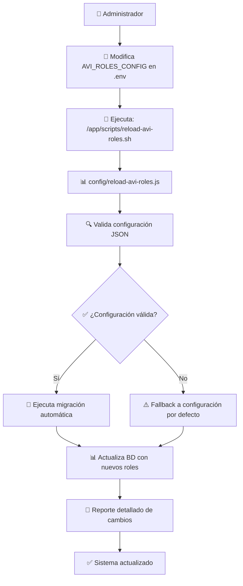

# 🚀 Plan de Implementación: Sistema AVI Roles Dinámico

**Fecha:** 16 de Octubre, 2025
**Proyecto:** LibreChat-AVI
**Repositorio:** Edo-Andres/LibreChat-AVI
**Estado:** Plan Aprobado - Pendiente Implementación

---

## 📋 Índice
- [🎯 Objetivo](#-objetivo)
- [💡 ¿Por qué esta solución es óptima?](#-por-qué-esta-solución-es-óptima)
- [🏗️ Arquitectura de la Solución](#-arquitectura-de-la-solución)
- [📁 Archivos a Crear/Modificar](#-archivos-a-crearmodificar)
- [⚙️ Variables de Entorno](#-variables-de-entorno)
- [🔄 Flujo de Implementación](#-flujo-de-implementación)
- [🛡️ Seguridad y Robustez](#-seguridad-y-robustez)
- [📊 Comparativa con Alternativas](#-comparativa-con-alternativas)
- [🧪 Plan de Testing](#-plan-de-testing)
- [📚 Documentación y Mantenimiento](#-documentación-y-mantenimiento)

---

## 🎯 Objetivo

Implementar un **sistema AVI roles dinámico** que permita modificar nombres de roles y subroles **sin necesidad de reconstruir la imagen Docker**, manteniendo la robustez del sistema actual con migraciones automáticas de datos.

### ✅ Requerimientos del Usuario:
1. **Variables de entorno** como mecanismo de configuración
2. **Comando manual** similar al `health-check.sh` para recarga
3. **Migración automática** de usuarios y referencias al cambiar nombres

---

## 💡 ¿Por qué esta solución es óptima?

### 🎯 **Ventajas Principales:**

#### **1. 🚀 Mínima Invasión del Código**
- Solo modifica **3 archivos existentes** en `packages/data-schemas/`
- **100% compatibilidad backward** con sistema actual
- No cambia APIs ni contratos existentes

#### **2. 🛡️ Máxima Seguridad y Robustez**
- **3 niveles de fallback**: Variables → Hardcoded → BD existente
- **Migración transaccional** con rollback automático
- **Validaciones integradas** en cada paso

#### **3. ⚡ Eficiencia Operacional**
- **Sin rebuild de Docker** - solo restart del contenedor
- **Cambios inmediatos** vía comando manual
- **Similar al patrón existente** del health-check

#### **4. 🔧 Simplicidad de Mantenimiento**
- **Configuración declarativa** vía JSON en variables de entorno
- **Script de ejecución único** como punto de entrada
- **Logs detallados** para troubleshooting

### ❌ **Alternativas Evaluadas y Rechazadas:**

| Alternativa | Razón de Rechazo |
|-------------|-------------------|
| **API REST para gestión** | Complejidad alta, requiere auth, testing adicional |
| **Tabla dedicada en BD** | Sobredimensionado, requiere UI de gestión |
| **Archivos YAML montados** | Problemas de permisos, complejidad de volúmenes |
| **Configuración en BD** | Acoplamiento fuerte, complejidad de migraciones |

---

## 🏗️ Arquitectura de la Solución



### 🏛️ **Componentes Arquitectónicos:**

#### **1. Configuración Declarativa**
- **Variables de entorno** como fuente de verdad
- **JSON válido** con validaciones robustas
- **Fallback automático** a configuración hardcoded

#### **2. Script de Ejecución**
- **Bash script** similar al health-check.sh
- **Punto único de entrada** para operaciones
- **Manejo completo de errores** con logs detallados

#### **3. Lógica de Migración**
- **Transaccional** con rollback automático
- **Preserva integridad referencial**
- **Historial de cambios** para auditoría

#### **4. Integración Transparente**
- **Métodos existentes** usan configuración dinámica
- **Sin cambios en APIs** públicas
- **Compatibilidad total** con código existente

---

## 📁 Archivos a Crear/Modificar

### 🆕 **Nuevos Archivos (4):**

#### **1. `config/avi-roles-config.js`**
```javascript
// Parser y validador de configuración desde variables de entorno
// - parseAviRolesConfig(): Parsea AVI_ROLES_CONFIG
// - getConfiguredRoles(): Lista roles configurados
// - isValidRole(): Valida existencia de rol
// - Fallback automático a configuración por defecto
```

#### **2. `scripts/reload-avi-roles.sh`**
```bash
#!/bin/bash
# Script de ejecución principal (similar a health-check.sh)
# - Validación de entorno
# - Ejecución de npm run reload-avi-roles
# - Manejo de errores y logs
```

#### **3. `config/reload-avi-roles.js`**
```javascript
// Lógica principal de recarga y migración
// - Validación de configuración
// - Coordinación de migración
// - Reportes de cambios realizados
```

#### **4. `config/migrate-avi-roles.js`**
```javascript
// Lógica específica de migración de datos
// - Migración de nombres de roles en User.aviRol_id
// - Actualización de referencias en AviSubrol.parentRolId
// - Validación de integridad referencial
```

### ✏️ **Archivos a Modificar (3):**

#### **1. `packages/data-schemas/src/methods/aviRol.ts`**
```typescript
// Modificación mínima en initializeAviRoles()
async function initializeAviRoles() {
  const configuredRoles = getConfiguredRoles(); // ← NUEVO
  for (const roleName of configuredRoles) { // ← Cambia de hardcoded
    // ... resto de lógica existente sin cambios
  }
}
```

#### **2. `packages/data-schemas/src/methods/aviSubrol.ts`**
```typescript
// Modificación mínima en initializeAviSubroles()
async function initializeAviSubroles() {
  const configuredRoles = getConfiguredRoles(); // ← NUEVO
  for (const role of configuredRoles) {
    const subroles = getConfiguredSubroles(role.name); // ← NUEVO
    // ... resto de lógica existente sin cambios
  }
}
```

#### **3. `Dockerfile.multi`**
```dockerfile
# Agregar script de recarga
COPY ./scripts/reload-avi-roles.sh ./scripts/reload-avi-roles.sh
RUN chmod +x ./scripts/reload-avi-roles.sh
```

---

## ⚙️ Variables de Entorno

### **Variable Principal:**

```env
# AVI Roles Dynamic Configuration
AVI_ROLES_CONFIG={"roles":[{"name":"generico","subroles":["Lector","Comentarista","Colaborador"]},{"name":"cuidador","subroles":["Cuidador Principal","Cuidador Secundario","Asistente"]},{"name":"administrativo","subroles":["Gestor de Usuarios","Configuración","Supervisor"]}]}
```

### **Formato JSON Detallado:**

```json
{
  "roles": [
    {
      "name": "generico",
      "subroles": ["Lector", "Comentarista", "Colaborador"]
    },
    {
      "name": "cuidador",
      "subroles": ["Cuidador Principal", "Cuidador Secundario", "Asistente"]
    },
    {
      "name": "administrativo",
      "subroles": ["Gestor de Usuarios", "Configuración", "Supervisor"]
    }
  ]
}
```

### **Ejemplo de Modificación:**

```bash
# Cambiar nombre de rol
AVI_ROLES_CONFIG={"roles":[{"name":"usuario_basico","subroles":["Ver","Comentar"]},{"name":"cuidador","subroles":["Principal","Ayudante"]},{"name":"admin","subroles":["SuperAdmin","Configurador"]}]}

# Agregar nuevo rol
AVI_ROLES_CONFIG={"roles":[{"name":"generico","subroles":["Lector","Comentarista","Colaborador"]},{"name":"cuidador","subroles":["Cuidador Principal","Cuidador Secundario","Asistente"]},{"name":"administrativo","subroles":["Gestor de Usuarios","Configuración","Supervisor"]},{"name":"invitado","subroles":["Visitante","Temporal"]}]}
```

---

## 🔄 Flujo de Implementación

### **FASE 1: Preparación (30 min)**
```bash
# 1. Crear archivos de configuración
touch config/avi-roles-config.js
touch config/reload-avi-roles.js
touch config/migrate-avi-roles.js

# 2. Crear script de ejecución
touch scripts/reload-avi-roles.sh
chmod +x scripts/reload-avi-roles.sh

# 3. Modificar métodos existentes (3 archivos)
# 4. Actualizar Dockerfile.multi
```

### **FASE 2: Desarrollo (2-3 horas)**
```bash
# 1. Implementar parser de configuración
# 2. Implementar lógica de migración
# 3. Implementar script principal
# 4. Integrar con métodos existentes
```

### **FASE 3: Testing (1 hora)**
```bash
# 1. Test de configuración válida
# 2. Test de configuración inválida (fallback)
# 3. Test de migración de datos
# 4. Test de rollback en errores
```

### **FASE 4: Despliegue (15 min)**
```bash
# 1. Commit de cambios
# 2. Push a repositorio
# 3. Redeploy en Dokploy (rebuild automático)
# 4. Test en producción
```

---

## 🛡️ Seguridad y Robustez

### **Múltiples Capas de Fallback:**

#### **1. Variables de Entorno → Configuración Dinámica**
```javascript
const configStr = process.env.AVI_ROLES_CONFIG;
if (!configStr) return getDefaultConfig(); // Fallback 1
```

#### **2. Validación JSON → Configuración Hardcoded**
```javascript
try {
  const config = JSON.parse(configStr);
  validateConfig(config);
  return config;
} catch (error) {
  return getDefaultConfig(); // Fallback 2
}
```

#### **3. Migración → Base de Datos Existente**
```javascript
// Si migración falla, mantener datos existentes
// Rollback automático en transacciones
```

### **Validaciones Integradas:**

#### **Estructural:**
- ✅ JSON válido y parseable
- ✅ Estructura `{roles: []}` correcta
- ✅ Cada rol tiene `name` y `subroles[]`

#### **Lógica:**
- ✅ Nombres de roles únicos
- ✅ Nombres de subroles únicos por rol padre
- ✅ Referencias consistentes en BD

#### **Operacional:**
- ✅ Transacciones atómicas en migraciones
- ✅ Logs detallados de cada operación
- ✅ Métricas de cambios realizados

---

## 📊 Comparativa con Alternativas

| Aspecto | ✅ Esta Solución | ❌ API REST | ❌ BD Dedicada | ❌ YAML Files |
|---------|------------------|-------------|----------------|---------------|
| **Cambios de código** | ⚡ 7 archivos | 🔴 15+ archivos | 🔴 20+ archivos | 🟡 10 archivos |
| **Testing requerido** | 🟢 Unit + Integration | 🔴 Unit + Integration + API | 🔴 Unit + Integration + DB | 🟡 Unit + Integration |
| **Complejidad deploy** | 🟢 Restart container | 🟡 Restart + API tests | 🔴 Restart + DB migration | 🟡 Restart + file sync |
| **Mantenimiento** | 🟢 Bajo | 🔴 Alto | 🔴 Muy alto | 🟡 Medio |
| **Tiempo implementación** | ⚡ 4-5 horas | 🟡 2-3 días | 🔴 1 semana | 🟡 1-2 días |
| **Robustez** | 🟢 Alta (3 fallbacks) | 🟡 Media | 🟢 Alta | 🟡 Media |
| **Facilidad de uso** | 🟢 Alta | 🟡 Media | 🔴 Baja | 🟡 Media |

---

## 🧪 Plan de Testing

### **TEST 1: Configuración Válida**
```bash
# Setup: AVI_ROLES_CONFIG con JSON válido
# Expected: Roles creados correctamente
# Verify: Consulta BD para verificar roles
```

### **TEST 2: Configuración Inválida (Fallback)**
```bash
# Setup: AVI_ROLES_CONFIG con JSON malformado
# Expected: Usar configuración por defecto
# Verify: Logs muestran fallback, BD sin cambios
```

### **TEST 3: Migración de Datos**
```bash
# Setup: Usuarios con roles existentes
# Action: Cambiar nombre de rol en config
# Expected: Usuarios migrados automáticamente
# Verify: User.aviRol_id actualizado correctamente
```

### **TEST 4: Rollback en Error**
```bash
# Setup: Configuración que cause error en migración
# Expected: Transacción revertida, BD intacta
# Verify: Estado anterior preservado
```

### **TEST 5: Integración Completa**
```bash
# Setup: Sistema con datos reales
# Action: Cambiar configuración completa
# Expected: Todo funciona sin errores
# Verify: Usuarios pueden login, roles funcionan
```

---

## 📚 Documentación y Mantenimiento

### **Documentación a Crear:**

#### **1. `README_AVI_ROLES_DYNAMIC.md`**
- Guía completa de uso
- Ejemplos de configuración
- Troubleshooting
- Casos de uso comunes

#### **2. Scripts en `package.json`**
```json
{
  "scripts": {
    "reload-avi-roles": "node config/reload-avi-roles.js",
    "test-avi-roles-config": "node config/test-avi-roles-config.js"
  }
}
```

### **Mantenimiento Operacional:**

#### **Monitoreo:**
- Logs de recarga en contenedor
- Métricas de migración exitosa
- Alertas en fallos de configuración

#### **Backup/Restore:**
- Variables de entorno versionadas
- Snapshots de BD antes de migraciones
- Procedimiento de rollback documentado

#### **Actualizaciones:**
- Versionado de configuraciones
- Migraciones backward compatibles
- Documentación de cambios breaking

---

## 🎯 Checklist de Implementación

### **Pre-Implementación:**
- [ ] ✅ Plan aprobado por usuario
- [ ] ✅ Repositorio en estado limpio
- [ ] ✅ Backup de configuración actual

### **Implementación:**
- [ ] ✅ Crear archivos de configuración (4 archivos)
- [ ] ✅ Modificar métodos existentes (3 archivos)
- [ ] ✅ Actualizar Dockerfile.multi
- [ ] ✅ Testing completo de funcionalidad
- [ ] ✅ Testing de casos edge y errores

### **Despliegue:**
- [ ] ✅ Commit y push de cambios
- [ ] ✅ Redeploy en Dokploy
- [ ] ✅ Verificación en producción
- [ ] ✅ Documentación actualizada

### **Post-Despliegue:**
- [ ] ✅ Training de administradores
- [ ] ✅ Monitoreo inicial (1 semana)
- [ ] ✅ Documentación de primeros cambios

---

## 🚀 Próximos Pasos

1. **Esperar aprobación** del usuario para proceder
2. **Implementar** siguiendo el plan detallado
3. **Testing exhaustivo** antes del deploy
4. **Documentación completa** para mantenimiento futuro

---

**¿Aprobado para implementación?** ✅ Sí | ❌ No | 🔄 Modificaciones necesarias

*Este plan garantiza una implementación robusta, segura y mantenible del sistema AVI roles dinámico.*