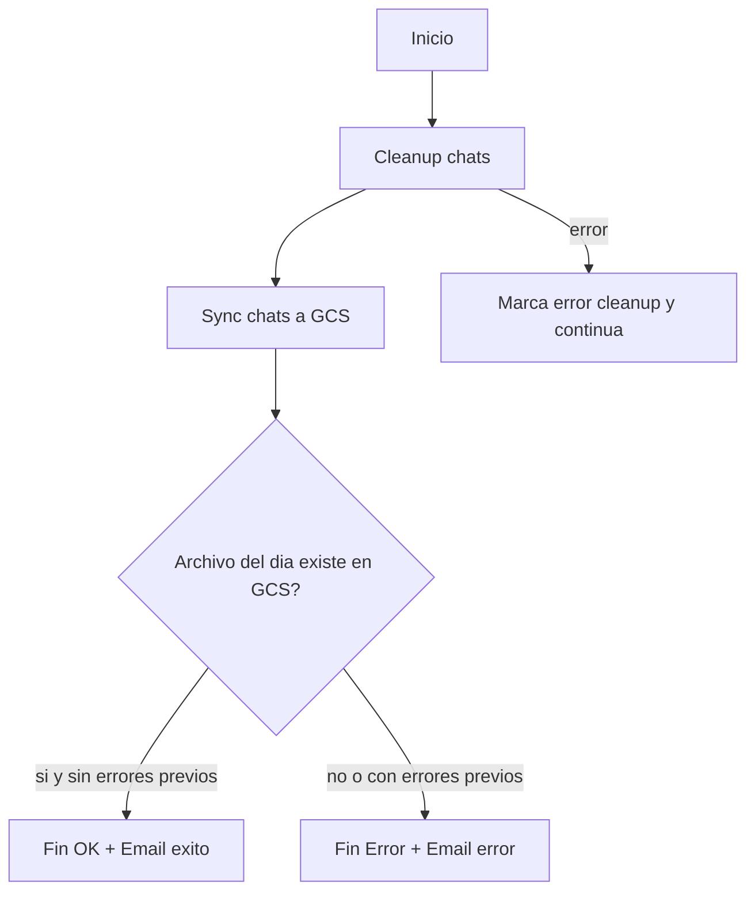

# Plan de respaldo programado a GCS (cronjob unificado)

## Objetivo
Automatizar con un solo cronjob un flujo confiable que limpia chats antiguos, exporta y sube el CSV extendido a GCS, verifica que el archivo del dia exista y envia notificaciones por email si hay fallas.

El cronjob unificado reemplaza al cronjob anterior de limpieza individual.

## Flujo
Inicio -> limpieza (parametrizable) -> export y upload -> verificacion en GCS (fecha UTC) -> fin OK
Si falla cleanup o sync: se ejecuta igualmente la verificacion/finalizacion para enviar notificacion por email y terminar con error.

### Punto de entrada unico (Dokploy)
- Comando cronjob: `sh /app/scripts/backup-chats-gcs --force --days 15`
- Si en el futuro se quiere cambiar retencion, se modifica solo el cronjob (ejemplo: `--days 30`) sin editar scripts.

## Diagrama (flujo)

## Componentes existentes que se reutilizan
- Limpieza: [scripts/cleanup-chats.sh](scripts/cleanup-chats.sh)
- Sync GCS: [scripts/sync-chats-gcs-extended.sh](scripts/sync-chats-gcs-extended.sh)
- Orquestador unico (nuevo): `scripts/backup-chats-gcs`
- Notificaciones por email: [config/services/email-notifier.js](config/services/email-notifier.js)
- Config de emails: [config/health-check/load-config.js](config/health-check/load-config.js)
- Referencia de uso de email: [config/health-check/health-check-with-email.js](config/health-check/health-check-with-email.js)
- Patron de nombre del archivo en GCS: [config/upload-to-gcs-extended.js](config/upload-to-gcs-extended.js)

## Parametros de limpieza
El orquestador unificado reenvia los argumentos recibidos al script de limpieza.

- Ejemplo actual: `--force --days 15`
- Comportamiento esperado del orquestador:
  - Si se pasan argumentos en cronjob: usar esos argumentos en cleanup.
  - Si no se pasan argumentos: usar defaults seguros (`--force --days 15`).

## Variables de entorno usadas para email
Estas variables ya estan en uso por el health-check y se reutilizan:
- `EMAIL_HOST`, `EMAIL_PORT`, `EMAIL_ENCRYPTION`, `EMAIL_USERNAME`, `EMAIL_PASSWORD`
- `EMAIL_SERVICE`, `EMAIL_ALLOW_SELFSIGNED`, `EMAIL_FROM_NAME`, `EMAIL_FROM`
- `HEALTH_CHECK_ADMIN_EMAIL` (en caso de error enviar email a los 2 primeros emails del array, en caso de exito enviar email solo al primer email del array)

## Verificacion del archivo en GCS
El nombre del archivo usa fecha UTC. La verificacion debe buscar que contenga:
- `_YYYY-MM-DD_` (fecha UTC del dia de ejecucion)

## Asuntos de email
- Exito: "✅ Respaldo programado OK: limpieza + exportacion a GCS"
- Error: "❌ Respaldo programado fallido: cleanup/sync GCS"

## Implementacion propuesta (resumen)
1. Crear un wrapper en scripts/ con nombre `backup-chats-gcs` que orqueste el flujo completo en `sh`.
2. Reutilizar [scripts/cleanup-chats.sh](scripts/cleanup-chats.sh) reenviando argumentos (`"$@"`).
3. Reutilizar [scripts/sync-chats-gcs-extended.sh](scripts/sync-chats-gcs-extended.sh) para export + upload.
4. Reutilizar [config/verify-gcs-chats-extended.js](config/verify-gcs-chats-extended.js) para verificacion y notificacion.
5. Ajustar Dokploy para ejecutar solo: `sh /app/scripts/backup-chats-gcs --force --days 15`.
6. Desactivar/eliminar el cronjob previo de cleanup standalone para evitar doble ejecucion.
7. Probar ejecucion manual y verificar emails y existencia del archivo en GCS.

## Validacion
- Ejecucion exitosa: se observa archivo en GCS con fecha UTC del dia.
- Falla en limpieza: email de error y exit code != 0.
- Falla en verificacion GCS: email de error y exit code != 0.
- Cambio de retencion: al modificar `--days N` en el cronjob, cleanup debe respetar el nuevo valor sin cambios en codigo.
