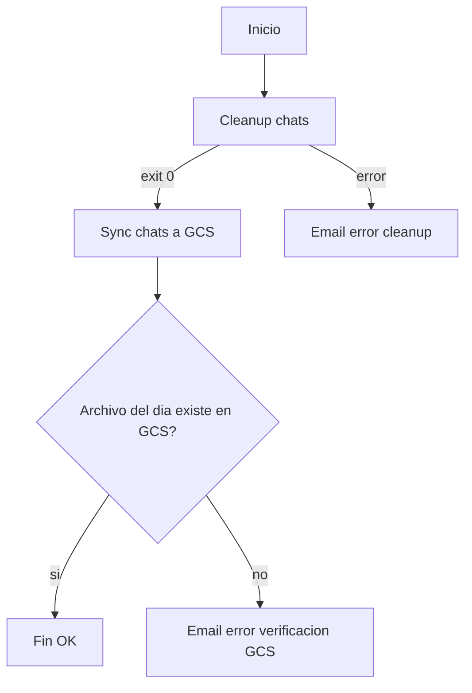

# Plan de respaldo programado a GCS (cleanup + export + verificacion)

## Objetivo
Automatizar cada 15 dias un flujo confiable que limpia chats antiguos, exporta y sube el CSV extendido a GCS, verifica que el archivo del dia exista y envia notificaciones por email si hay fallas.

## Flujo
Inicio -> limpieza -> si OK, export y upload -> verificacion en GCS (fecha UTC) -> fin OK
Si falla en cualquier paso: enviar email de error y terminar con error.

## Diagrama (flujo)

## Componentes existentes que se reutilizan
- Limpieza: [scripts/cleanup-chats.sh](scripts/cleanup-chats.sh)
- Sync GCS: [scripts/sync-chats-gcs-extended.sh](scripts/sync-chats-gcs-extended.sh)
- Notificaciones por email: [config/services/email-notifier.js](config/services/email-notifier.js)
- Config de emails: [config/health-check/load-config.js](config/health-check/load-config.js)
- Referencia de uso de email: [config/health-check/health-check-with-email.js](config/health-check/health-check-with-email.js)
- Patron de nombre del archivo en GCS: [config/upload-to-gcs-extended.js](config/upload-to-gcs-extended.js)

## Variables de entorno usadas para email
Estas variables ya estan en uso por el health-check y se reutilizan:
- `EMAIL_HOST`, `EMAIL_PORT`, `EMAIL_ENCRYPTION`, `EMAIL_USERNAME`, `EMAIL_PASSWORD`
- `EMAIL_SERVICE`, `EMAIL_ALLOW_SELFSIGNED`, `EMAIL_FROM_NAME`, `EMAIL_FROM`
- `HEALTH_CHECK_ADMIN_EMAIL` (primer email para exito, todos para error)

## Verificacion del archivo en GCS
El nombre del archivo usa fecha UTC. La verificacion debe buscar el prefijo:
- `chats_extended_YYYY-MM-DD_` (fecha UTC del dia de ejecucion)

## Asuntos de email
- Exito: "✅ Respaldo programado OK: limpieza + exportacion a GCS"
- Error: "❌ Respaldo programado fallido: cleanup/sync GCS"

## Implementacion propuesta (resumen)
1. Crear un wrapper en scripts/ que orqueste el flujo completo en `sh`.
2. Crear un verificador Node en config/ que consulte GCS con `@google-cloud/storage`.
3. Ajustar el schedule de Dokploy para ejecutar solo el wrapper.
4. Probar ejecucion manual y verificar emails y existencia del archivo en GCS.

## Validacion
- Ejecucion exitosa: se observa archivo en GCS con fecha UTC del dia.
- Falla en limpieza: email de error y exit code != 0.
- Falla en verificacion GCS: email de error y exit code != 0.
