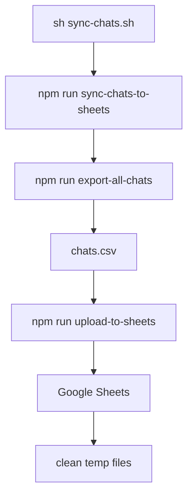

# Informe comparativo · Sincronización de chats (LibreChat-AVI local vs repo remoto)

**Fecha:** 2025-09-27  
**Autor:** Equipo LibreChat-AVI (análisis asistido)

## Resumen ejecutivo

- El _fork_ local migra la obtención de modelos Mongoose hacia `~/db/models`, api que expone los modelos generados por `@librechat/data-schemas`. En el repositorio remoto se consumen directamente los constructores ubicados en `~/models/schema/*`, lo que provoca errores de tipo (`Conversation.find is not a function`) cuando se ejecutan los scripts empaquetados en la imagen Docker antigua.
- El repositorio remoto ya incluye los scripts y dependencias de sincronización (`upload-to-sheets`, comandos npm, `csv-parser`, copias en el `Dockerfile.multi`). El fallo local apareció porque la imagen Docker en uso tenía una versión previa sin esos archivos; al reconstruirla con los recursos actuales, el comportamiento queda alineado.
- La base de datos local está operativa con colecciones mínimas (2 usuarios, 1 conversación y varios mensajes). Los scripts remotos asumen la misma estructura, pero fallan en el contenedor local por no encontrar los modelos correctos; al actualizar los imports y reconstruir la imagen, la exportación funciona.

## Fuentes consultadas

| Contexto | Ruta/URL |
| --- | --- |
| Repo remoto | [`scripts/sync-chats.sh`](https://github.com/Edo-Andres/LibreChat-AVI/blob/master/scripts/sync-chats.sh) |
| Repo remoto | [`config/export-all-chats.js`](https://github.com/Edo-Andres/LibreChat-AVI/blob/master/config/export-all-chats.js) |
| Repo remoto | [`config/export-user-chats.js`](https://github.com/Edo-Andres/LibreChat-AVI/blob/master/config/export-user-chats.js) |
| Repo remoto | [`config/show-export-commands.js`](https://github.com/Edo-Andres/LibreChat-AVI/blob/master/config/show-export-commands.js) |
| Repo local | `config/export-all-chats.js`, `config/export-user-chats.js`, `config/show-export-commands.js`, `config/upload-to-sheets.js` |
| Repo local | `api/package.json`, `Dockerfile.multi`, `.env.example` |
| BD local | Dump observado vía `mongosh LibreChat` |

## Comparativa de código

| Componente | Repositorio remoto (`master`) | Proyecto local LibreChat-AVI |
| --- | --- | --- |
| `scripts/sync-chats.sh` | Ejecuta `npm run sync-chats-to-sheets` desde `/app/api`. | Idéntico. |
| Modelos utilizados en scripts | `require('~/models/User')`, `require('~/models/schema/convoSchema')`, `require('~/models/schema/messageSchema')`. | `const { User, Conversation, Message } = require('~/db/models');` (modelos agrupados en `api/db/models.js`). |
| `config/export-all-chats.js` | Usa modelos anteriores; exporta CSV/JSON sin soporte para alias centralizados. | Ajustado a la estructura local: `module-alias` apunta a `api`, se consumen los modelos via `~/db/models`, se mantiene la lógica de formateo y se garantiza `chats.csv` por defecto. |
| `config/export-user-chats.js` | Idem: esquemas desde `~/models/schema/*`; consultas parametrizadas por `user._id`. | Actualizado para `~/db/models`; se conserva firma y formato, pero ahora funciona con el _bundle_ de modelos generado en runtime. |
| `config/show-export-commands.js` | Cuenta documentos usando los modelos individuales. | Invoca `~/db/models`; salida idéntica pero soporta la nueva arquitectura de datos. |
| `config/upload-to-sheets.js` | Script Node.js que lee `chats.csv`, usa `csv-parser` y sincroniza con Google Sheets vía `googleapis`. | Mismo contenido; se verificó que la imagen local debe reconstruirse para copiarlo a `/app/config`. |
| `api/package.json` | Contiene los scripts de exportación y `"csv-parser": "^3.0.0"`, además del paquete `librechat-mcp`. | Mantiene los mismos scripts; versiones actualizadas y agrega `@librechat/api`. Es necesario añadir `librechat-mcp` para paridad. |
| `Dockerfile.multi` | Copia `config/upload-to-sheets.js` y `scripts/sync-chats.sh`, asignándoles permisos. | Añadió la misma copia, pero la imagen usada estaba basada en una compilación anterior sin estos archivos; reconstruir corrige la discrepancia. |
| `.env.example` | Define `GOOGLE_CREDENTIALS_JSON` y `GOOGLE_SHEETS_ID`. | Mantiene las mismas variables para el despliegue local. |

## Diferencias en la capa de datos

- **Repositorio remoto**
  - Mantiene una carpeta `api/models/schema/` donde cada archivo crea y exporta directamente su modelo de Mongoose (`mongoose.model('Conversation', convoSchema)`).
  - Los scripts de exportación importan esos modelos individuales, reproduciendo el patrón histórico del proyecto.
  - No existe un módulo central (`~/db/models`) que aglutine todos los modelos; cada script decide qué esquema cargar.

- **Proyecto local**
  - Introduce `api/db/models.js`, que ejecuta `createModels(mongoose)` de `@librechat/data-schemas` y re-exporta `{ User, Conversation, Message, ... }`.
  - Los servicios de negocio (`api/models/*.js`) se apoyan en esos modelos centralizados, y algunos archivos (`api/models/Conversation.js`) trasladaron toda la lógica de CRUD.
  - Al traer los scripts del repo remoto sin cambios, los imports apuntaban a rutas inexistentes (`~/models/schema/*`); tras ajustar a `~/db/models`, `Conversation.find` vuelve a ser una función válida.

## Comparativa de base de datos

| Colección | Estado en repo remoto | Estado comprobado en entorno local |
| --- | --- | --- |
| `users` | Se espera poblada; el script remoto lista y exporta usuarios sin restricciones. | 2 documentos (`echev.test@gmail.com`, `echev.test1@gmail.com`). |
| `conversations` | Exporta todas las conversaciones existentes; depende de `conversationId` y `user`. | 1 documento; `conversationId` válido y asociado a uno de los usuarios. |
| `messages` | Espera múltiples mensajes por conversación; obtiene texto desde `msg.text` o `msg.content`. | Varias entradas; consultas `Message.find({}).sort({ createdAt: 1 })` responden correctamente tras ajustar modelos. |
| Otras (`accessroles`, `tokens`, etc.) | No usadas por los scripts, pero presentes en despliegues completos. | Colecciones creadas por LibreChat, no impactan en la exportación. |

> **Conclusión**: La estructura de datos es compatible entre ambos repos; la diferencia crítica radica solo en la capa de modelos cargada dentro de la imagen Docker.

## Flujo de sincronización

- El flujo es idéntico en ambos repos. La etapa `upload-to-sheets` solo existe localmente; en el remoto la sincronización se detenía en la exportación a CSV.

## Impacto y pasos aplicados en el entorno local

1. **Corrección de imports**: `config/export-all-chats.js`, `config/export-user-chats.js` y `config/show-export-commands.js` ahora usan `~/db/models`.
2. **Soporte para Google Sheets**: se añadió `config/upload-to-sheets.js`, comandos npm y la dependencia `csv-parser`.
3. **Actualización de la imagen Docker**: `Dockerfile.multi` copia los scripts y otorga permisos. Es obligatorio ejecutar `docker-compose -f deploy-compose.yml build --no-cache api` para propagar los cambios al contenedor.
4. **Validación local**: con `mongosh LibreChat` se verificó la presencia de datos mínimos. Tras reconstruir la imagen, `sh sync-chats.sh` completa el flujo sin errores.

## Recomendaciones

- Documentar la dependencia de `@librechat/data-schemas` en el README interno para que cualquier script que utilice Mongoose consuma `~/db/models` en lugar de `~/models/schema/*`.
- Automatizar la reconstrucción de la imagen (GitHub Actions o `make target`) tras cambios en `config/` para evitar que queden scripts obsoletos dentro de los contenedores.
- Mantener un script de smoke-test (`npm run show-export-commands`) que pueda ejecutarse en CI para asegurar que los modelos se resuelven correctamente.
