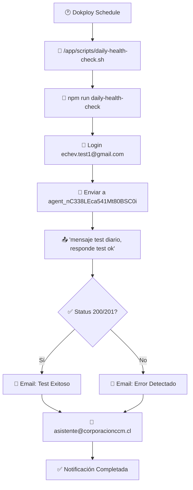

# 🩺 Health Check Diario Automático - LibreChat

Esta guía documenta la implementación del sistema de Health Check diario automático para LibreChat, que verifica el funcionamiento del servicio y envía notificaciones por email.

## 📋 Índice
- [🎯 Objetivo](#-objetivo)
- [🏗️ Arquitectura del Sistema](#-arquitectura-del-sistema)
- [📁 Archivos Implementados](#-archivos-implementados)
- [⚙️ Configuración](#-configuración)
- [🚀 Configuración en Dokploy](#-configuración-en-dokploy)
- [🧪 Pruebas y Verificación](#-pruebas-y-verificación)
- [📧 Tipos de Notificaciones](#-tipos-de-notificaciones)
- [🐛 Resolución de Problemas](#-resolución-de-problemas)

## 🎯 Objetivo

Implementar un sistema automatizado que:
- **Verifica diariamente** el funcionamiento completo de LibreChat
- **Testa el flujo real** de login y envío de mensajes
- **Notifica por email** tanto éxitos como errores
- **Detecta problemas** antes que los usuarios

### ✅ Características del Sistema
- **100% Node.js** - Consistente con el stack del proyecto
- **Test completo** - Login + Chat con agente real
- **Notificaciones duales** - Éxito y error por email
- **Detección de errores** - Rate limits, timeouts, problemas de API
- **Logs detallados** - Para debugging y monitoreo

## 🏗️ Arquitectura del Sistema



## 📁 Archivos Implementados

### 🆕 Archivos Nuevos
```
├── config/daily-health-check.js                           # Script Node.js principal
├── scripts/daily-health-check.sh                          # Script bash ejecutor
├── api/server/utils/emails/healthCheckSuccess.handlebars  # Template email éxito
├── api/server/utils/emails/healthCheckError.handlebars    # Template email error
└── README_DAILY_HEALTH_CHECK.md                           # Esta documentación
```

### ✏️ Archivos Modificados
```
├── api/package.json           # Nuevo script "daily-health-check"
├── .env.example              # Variables de configuración
└── Dockerfile.multi          # Inclusión de scripts en imagen Docker
```

## ⚙️ Configuración

### **1. Variables de Entorno (.env)**

Agregar las siguientes variables a tu archivo `.env`:

```env
#==========================#
# Daily Health Check       #
#==========================#

# Health Check Configuration
HEALTH_CHECK_URL=https://avi.corporacionccm.cl
HEALTH_CHECK_EMAIL=echev.test1@gmail.com
HEALTH_CHECK_PASSWORD=12341234
HEALTH_CHECK_AGENT_ID=agent_nC338LEca541Mt80BSC0i

# Notification Email (uses existing EMAIL_ config)
HEALTH_CHECK_ADMIN_EMAIL=asistente@corporacionccm.cl
```

### **2. Verificar Configuración de Email**

Asegurar que las variables de email estén configuradas:

```env
# Email Password Reset (ya configurado)
EMAIL_SERVICE=gmail
EMAIL_USERNAME=asistente@corporacionccm.cl
EMAIL_PASSWORD=tu_password_aqui
EMAIL_FROM_NAME=Asistente AVI
EMAIL_FROM=asistente@corporacionccm.cl
EMAIL_HOST=smtp.gmail.com
EMAIL_PORT=587
EMAIL_ENCRYPTION=starttls
EMAIL_ALLOW_SELFSIGNED=false
```

### **3. Rebuild de la Imagen Docker**

```bash
# En tu repositorio Git
git add .
git commit -m "feat: Add daily health check system with email notifications"
git push origin develop

# En Dokploy: Trigger rebuild desde UI
```

## 🚀 Configuración en Dokploy

### **1. Crear Schedule/Cron Job**

En la interfaz de Dokploy:

1. Ve al servicio **API**
2. Busca sección **"Schedules"** o **"Cron Jobs"**
3. Clic **"Create Schedule"**
4. Configura:

```yaml
Service Name: api
Task Name: Daily Health Check LibreChat
Schedule: 0 3 * * *  # 3:00 AM (diferente al sync-chats)
Shell Type: sh
Command: /app/scripts/daily-health-check.sh
Enabled: ✅
```

### **2. Opciones de Horario**

```bash
# Horarios recomendados:
0 3 * * *   # 3:00 AM diario (recomendado)
0 4 * * *   # 4:00 AM diario
0 2 * * *   # 2:00 AM diario (evitar si tienes sync-chats)
30 2 * * *  # 2:30 AM diario
0 */6 * * * # Cada 6 horas (opcional)
```

## 🧪 Pruebas y Verificación

### **1. Prueba Manual**

```bash
# Conectarse al contenedor
docker exec -it LibreChat-API-local /bin/sh

# Ejecutar health check manualmente
/app/scripts/daily-health-check.sh

# O ejecutar directamente con Node.js
cd /app/api
npm run daily-health-check
```

### **2. Verificar Logs**

```bash
# Ver logs del contenedor
docker logs LibreChat-API-local -f

# Buscar logs específicos del health check
docker logs LibreChat-API-local 2>&1 | grep -i "health check"

# Ver logs de errores
docker logs LibreChat-API-local 2>&1 | grep -i error
```

### **3. Verificar Schedule en Dokploy**

1. Ve a **Schedules** del servicio API
2. Verifica que el job esté **Enabled**
3. Revisa **Last Run** y **Next Run**
4. Comprueba **Execution History**

## 📧 Tipos de Notificaciones

### **✅ Email de Éxito (Diario)**
- **Asunto**: `✅ LibreChat Health Check - Test Diario Exitoso`
- **Contenido**: 
  - Estado del servicio
  - Tiempo de respuesta
  - Métricas del test
  - Confirmación de funcionamiento
- **Frecuencia**: Una vez por día cuando todo funciona

### **❌ Email de Error (Solo cuando hay problemas)**
- **Asunto**: `🚨 LibreChat Health Check - Error Detectado`
- **Contenido**:
  - Detalle específico del error
  - Posibles causas
  - Acciones requeridas
  - Comandos de diagnóstico
- **Frecuencia**: Solo cuando el health check falla

### **📋 Información Incluida**
- URL de la aplicación
- Agente testado
- Timestamp con zona horaria Chile
- Detalles del error (si aplica)
- Tiempo de respuesta (si exitoso)

## 🐛 Resolución de Problemas

### **❌ Error: "Health Check falló: 429"**

**Causa**: Rate limit de API (Gemini/OpenAI)

**Solución**:
```bash
# 1. Verificar límites de API
# 2. Esperar reset del rate limit
# 3. Considerar cambiar horario del test
# 4. Verificar configuración de modelo
```

### **❌ Error: "Timeout en login"**

**Causa**: Servidor no responde en tiempo esperado

**Solución**:
```bash
# 1. Verificar conectividad
curl -I https://avi.corporacionccm.cl

# 2. Verificar estado de contenedores
docker ps

# 3. Reiniciar servicios si es necesario
docker restart LibreChat-API-local
```

### **❌ Error: "Login falló: 401"**

**Causa**: Credenciales incorrectas

**Solución**:
```bash
# 1. Verificar variables de entorno
docker exec -it LibreChat-API-local env | grep HEALTH_CHECK

# 2. Verificar credenciales manualmente en la web
# 3. Actualizar variables en .env si es necesario
```

### **❌ Error: "Chat falló: Agent not found"**

**Causa**: Agente ID no existe o no está disponible

**Solución**:
```bash
# 1. Verificar que el agente existe
# 2. Comprobar ID del agente en la URL
# 3. Actualizar HEALTH_CHECK_AGENT_ID si cambió
```

### **❌ No llegan emails**

**Causa**: Configuración de email incorrecta

**Solución**:
```bash
# 1. Verificar configuración de email
docker exec -it LibreChat-API-local env | grep EMAIL

# 2. Probar envío manual de email
# 3. Verificar credenciales SMTP
# 4. Revisar logs de errores de email
```

### **🔍 Debug Avanzado**

Para debug detallado, ejecutar manualmente:

```bash
# Entrar al contenedor
docker exec -it LibreChat-API-local /bin/sh

# Navegar al directorio
cd /app/api

# Ejecutar con logs detallados
DEBUG=* npm run daily-health-check

# Ver variables de entorno
env | grep HEALTH_CHECK
env | grep EMAIL
```

## 📊 Monitoreo y Mantenimiento

### **Logs Recomendados**
- Revisar emails diarios los primeros días
- Verificar que no haya errores recurrentes
- Monitorear tiempo de respuesta

### **Mantenimiento Periódico**
- Verificar que las credenciales no expiren
- Revisar que el agente siga existiendo
- Actualizar agente ID si es necesario
- Monitorear límites de rate de API

### **Métricas a Monitorear**
- Tasa de éxito del health check (debería ser ~100%)
- Tiempo de respuesta promedio
- Frecuencia de errores 429 (rate limit)
- Disponibilidad del servicio

---

## ✅ Checklist de Implementación

- [x] ✅ Script Node.js creado (`config/daily-health-check.js`)
- [x] ✅ Script bash creado (`scripts/daily-health-check.sh`)
- [x] ✅ Templates de email creados (éxito y error)
- [x] ✅ Package.json actualizado con nuevo script
- [x] ✅ Variables agregadas a .env.example
- [x] ✅ Dockerfile.multi actualizado
- [ ] ⏳ Variables configuradas en .env de producción
- [ ] ⏳ Imagen Docker reconstruida en Dokploy
- [ ] ⏳ Cron job configurado en Dokploy
- [ ] ⏳ Prueba manual ejecutada con éxito
- [ ] ⏳ Email de prueba recibido

---

## 🎉 Resultado Final

Una vez implementado, recibirás:

- **📧 Email diario de confirmación** cuando todo funcione correctamente
- **🚨 Email inmediato de alerta** cuando haya problemas
- **📊 Monitoreo automático** del estado del servicio
- **🛡️ Detección temprana** de problemas antes que afecten usuarios

El sistema está diseñado para ser **robusto, confiable y requerir mínimo mantenimiento**.

Para soporte adicional, revisar logs y consultar esta documentación. 🚀 