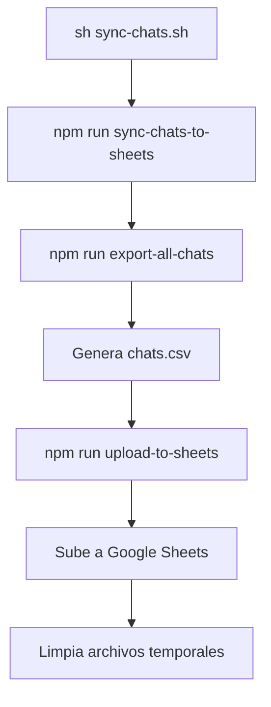

# Resumen: Implementación de Scripts de Exportación y Sincronización de Chats a Google Sheets

## ❌ Problema Inicial
Al ejecutar `sh sync-chats.sh`, se producía el error:
```
Error: Cannot find module '/app/api/models/User'
```
**Causa**: Los imports de modelos no coincidían con la estructura local de LibreChat-AVI.

## ✅ Soluciones Implementadas

### 1. Corrección de Imports de Modelos
**Archivos modificados**: `config/export-all-chats.js`, `config/export-user-chats.js`, `config/show-export-commands.js`

**Cambios**:
```javascript
// ANTES
const User = require('~/models/User');
const Conversation = require('~/models/Conversation');
const Message = require('~/models/Message');

// DESPUÉS
const { User, Conversation, Message } = require('~/db/models');
```

**Razón**: Los modelos Mongoose están centralizados en `~/db/models`, no en archivos individuales.

### 2. Actualización de Dependencias
- Agregado `"csv-parser": "^3.0.0"` a `api/package.json`
- Ejecutado `npm install` para actualizar `package-lock.json`

### 3. Creación de Archivos Nuevos
- **`config/upload-to-sheets.js`**: Script para subir datos CSV a Google Sheets
- **`scripts/sync-chats.sh`**: Script bash principal de sincronización
- **`config/export-user-chats.js`**: Exportación de chats por usuario
- **`config/show-export-commands.js`**: Muestra comandos disponibles

### 4. Actualización de Configuración Docker
**Archivo**: `Dockerfile.multi`
```dockerfile
# ✅ Scripts para sincronización con Google Sheets
COPY ./config/upload-to-sheets.js ./config/upload-to-sheets.js
COPY ./scripts/sync-chats.sh ./scripts/sync-chats.sh
RUN chmod +x ./scripts/sync-chats.sh
```

### 5. Variables de Entorno
**Archivo**: `.env.example`
```env
#==========================#
# Google Sheets Sync       #
#==========================#

GOOGLE_CREDENTIALS_JSON={"type":"service_account",...}
GOOGLE_SHEETS_ID=1-bhyU4cglhQHp5Ls8_ZitUvA7onz-Tu0SUtKPV4Gfgc
```

### 6. Scripts en package.json
**Archivo**: `api/package.json`
```json
"export-user-chats": "node ../config/export-user-chats.js",
"export-all-chats": "node ../config/export-all-chats.js",
"upload-to-sheets": "node ../config/upload-to-sheets.js",
"sync-chats-to-sheets": "npm run export-all-chats && npm run upload-to-sheets",
"show-export-commands": "node ../config/show-export-commands.js"
```

## 📊 Estructura Actual de MongoDB (LibreChat)

```javascript
LibreChat> show collections
accessroles
aclentries
agentcategories
agents
conversations    // ✅ 1 documento
groups
messages         // ✅ Varios mensajes
projects
promptgroups
roles
sessions
tokens
transactions
users            // ✅ 2 usuarios

LibreChat> db.conversations.countDocuments()
1

LibreChat> db.users.find().limit(2)
[
  {
    _id: ObjectId('68d59026fb606208f865dd8a'),
    name: 'test',
    email: 'echev.test@gmail.com'
  },
  {
    _id: ObjectId('68d752296ac1a8444e8ffa29'),
    name: 'testtt',
    email: 'echev.test1@gmail.com'
  }
]
```

## 🔄 Flujo del Script de Sincronización



### Comandos para ejecutar:
```bash
# Desde el contenedor
docker exec -it LibreChat-API sh -c "cd /app/scripts && sh sync-chats.sh"

# O paso a paso
docker exec -it LibreChat-API sh -c "cd /app/api && npm run export-all-chats"
docker exec -it LibreChat-API sh -c "cd /app/api && npm run upload-to-sheets"
```

## 📁 Estructura de Archivos Implementados

```
api/
├── package.json              # ✅ Scripts y dependencia csv-parser
└── db/
    └── models.js             # ✅ Modelos Mongoose centralizados

config/
├── export-all-chats.js       # ✅ Exporta todas las conversaciones
├── export-user-chats.js      # ✅ Exporta chats por usuario
├── upload-to-sheets.js       # ✅ Sube a Google Sheets
└── show-export-commands.js   # ✅ Muestra comandos disponibles

scripts/
└── sync-chats.sh             # ✅ Script principal

Dockerfile.multi               # ✅ Copia scripts y configura permisos
.env.example                   # ✅ Variables Google Sheets
```

## 🎯 Estado Actual
- ✅ **Archivos creados/modificados** según lógica del repo remoto
- ✅ **Imports corregidos** para estructura local
- ✅ **Dependencias instaladas**
- ✅ **Datos de prueba** en base de datos
- ⏳ **Pendiente**: Reconstruir imagen Docker con `docker-compose build --no-cache api`

## 🚀 Próximos Pasos
```bash
# Reconstruir imagen con cambios
docker-compose -f deploy-compose.yml build --no-cache api
docker-compose -f deploy-compose.yml up -d

# Probar sincronización
docker exec -it LibreChat-API sh -c "cd /app/scripts && sh sync-chats.sh"
```

## 📋 Checklist de Implementación
- [x] Scripts de exportación creados
- [x] Dependencia csv-parser agregada
- [x] Imports de modelos corregidos
- [x] Configuración Docker actualizada
- [x] Variables de entorno configuradas
- [ ] **Imagen Docker reconstruida**
- [ ] **Script probado exitosamente**

---
**Nota**: La implementación sigue fielmente la lógica del repositorio remoto, adaptada a la estructura específica de LibreChat-AVI. Una vez reconstruida la imagen Docker, el sistema de sincronización automática debería funcionar correctamente.